# Spectral Brand Theory — Framework & Toolkit

> Brands are stellar objects. You are the observer.

```mermaid
graph LR
    subgraph Brand["Brand Signal Source"]
        direction TB
        SEM((Semiotic))
        NAR((Narrative))
        IDE((Ideological))
        EXP((Experiential))
        SOC((Social))
        ECO((Economic))
        CUL((Cultural))
        TMP((Temporal))
    end

    subgraph Pipeline["Perception Pipeline"]
        direction TB
        OSP[Observer<br/>Spectral Profile]
        PC[Perception<br/>Cloud]
        CC[Conviction<br/>Collapse]
    end

    Brand -->|"8 dimensions"| OSP
    OSP -->|"filter + weight"| PC
    PC -->|"threshold"| CC

    style SEM fill:#fce4ec,stroke:#c62828
    style NAR fill:#e8eaf6,stroke:#283593
    style IDE fill:#e0f2f1,stroke:#004d40
    style EXP fill:#fff8e1,stroke:#f57f17
    style SOC fill:#f3e5f5,stroke:#6a1b9a
    style ECO fill:#e8f5e9,stroke:#2e7d32
    style CUL fill:#fbe9e7,stroke:#bf360c
    style TMP fill:#e3f2fd,stroke:#0d47a1
    style OSP fill:#e8eaf6,stroke:#333
    style PC fill:#fff3cd,stroke:#333
    style CC fill:#d4edda,stroke:#333
```




## What Is This?

Spectral Brand Theory (SBT) models brands as multi-dimensional signal sources perceived differently by every observer. There is no "brand in itself" — only signals and observers. This toolkit provides a six-module AI-native analytical pipeline that turns any capable LLM into a brand perception X-ray machine, producing structural diagnosis that traditional audits cannot.

## Quick Start

**Analyze your first brand in 10 minutes:**

1. Copy the prompt from [`prompts/01_BRAND_DECOMPOSITION.md`](prompts/01_BRAND_DECOMPOSITION.md)
2. Paste into Claude, GPT-4, or any capable LLM with your brand name
3. Get structured YAML output: signal inventory across 8 dimensions
4. Run all 6 modules for a complete **Spectral Brand Audit**

## The 6 Modules

| # | Module | What It Does | Input | Output |
|---|--------|-------------|-------|--------|
| 1 | [Brand Decomposition](prompts/01_BRAND_DECOMPOSITION.md) | Inventory signals across 8 dimensions | Brand name + materials | Signal map, D/A ratio |
| 2 | [Observer Mapping](prompts/02_OBSERVER_MAPPING.md) | Define audience spectral profiles | Brand context | 3-5 cohort profiles |
| 3 | [Cloud Prediction](prompts/03_CLOUD_PREDICTION.md) | Predict per-cohort perception clouds | Modules 1+2 | Cloud map per cohort |
| 4 | [Coherence Audit](prompts/04_COHERENCE_AUDIT.md) | Score brand coherence (7 metrics) | Module 3 | Grade (A+ to F) + type |
| 5 | [Emission Strategy](prompts/05_EMISSION_STRATEGY.md) | Design dimensionally specific action plan | Modules 1+2+4 | Strategy per cohort |
| 6 | [Re-collapse Simulation](prompts/06_RECOLLAPSE_SIMULATION.md) | Test disruption resilience | Modules 3+4 | Resilience profile |

Each module has a prompt + YAML template in [`templates/`](templates/).

## Validated on 5 Brands

| Brand | Coherence Type | Grade | Key Finding |
|-------|---------------|-------|-------------|
| Hermès | Ecosystem | A+ | Structural absence (dark signals) creates more value than emission |
| IKEA | Signal | A- | Consistent designed signals produce uniform resilience |
| Patagonia | Identity | B+ | Productive contradiction — ideological core filters cohort compatibility |
| Erewhon | Experiential asymmetry | B- | Local and mediated audiences perceive structurally different brands |
| Tesla | Incoherent | C- | Maximum emission power, minimum architectural health |

25+ non-obvious insights. 9 candidate mechanisms not found in existing branding literature.

## Key Concepts

| Concept | Definition |
|---------|-----------|
| **Dark signal** | Structural absence — designed restriction that functions as a signal |
| **Spectral profile** | Observer's sensitivity, weights, and tolerances across 8 dimensions |
| **Perception cloud** | Probabilistic cluster of signals forming in an observer's mind |
| **Conviction collapse** | Threshold event where a cloud crystallizes into a stable brand conviction |
| **Re-collapse** | Full rebuild of brand conviction from scratch when contradicting evidence arrives |
| **D/A ratio** | Designed vs. ambient signal balance (optimal zone: 55-65% designed) |
| **Coherence type** | Structural category of brand architecture (5 types, each with different resilience) |

## Mathematical Validation

Every pipeline output is validated against proven mathematical bounds from seven companion research papers (R0-R6):

| Validator | Paper | What It Checks |
|-----------|-------|----------------|
| Metric | R1 (Formal Metric) | Signal positivity, simplex constraints, triangle inequality |
| Metamerism | R2 (Spectral Metamerism) | Brands with similar scores but different 8D structure |
| Cohort | R3 (Cohort Boundaries) | Over-segmentation, false sharp boundaries |
| Capacity | R4 (Sphere Packing) | Positioning overcrowding, indistinguishable pairs |
| Trajectory | R6 (Diffusion Dynamics) | Absorption risk, irreversible perception decline |
| Specification | R5 (Impossibility) | Organizational spec coverage, cascade consistency |

The validation module (`src/spectral_branding/validators/`) is Python + numpy/scipy with 67 unit tests. It runs automatically on pipeline output, flagging geometric violations that no amount of prompt engineering can prevent.

## Repository Structure

```
sbt-framework/
├── prompts/                  6 prompt modules (copy-paste into any LLM)
│   ├── 01_BRAND_DECOMPOSITION.md
│   ├── 02_OBSERVER_MAPPING.md
│   ├── 03_CLOUD_PREDICTION.md
│   ├── 04_COHERENCE_AUDIT.md
│   ├── 05_EMISSION_STRATEGY.md
│   ├── 06_RECOLLAPSE_SIMULATION.md
│   └── README.md
├── templates/                YAML output schemas for structured results
│   ├── 01-06_*.yaml
│   └── FRAMEWORKS.md
├── data/
│   └── ATOM_TAXONOMY.yaml    Signal classification reference
├── docs/
│   ├── FRAMEWORK.md          Full theoretical framework (v2.3)
│   ├── GLOSSARY.md           Term definitions and relationships
│   └── architecture/         Mermaid architecture diagrams
│       ├── BRAND_PIPELINE.mmd    Full signal pipeline: emission → cloud → collapse
│       ├── OBSERVER_MODEL.mmd    Observer cohort spectral profiles
│       └── ALIBI_ANALOGY.mmd     Structural analogy: alibi finance ↔ SBT
├── CITATION.cff
├── LICENSE
└── README.md
```

## Research

| Resource | Description |
|----------|-------------|
| [Research Papers](https://github.com/spectralbranding/sbt-papers) | Working papers on SBT and the underlying epistemological architecture |
| [Brand Code](https://github.com/spectralbranding/brand-code) | Executable brand identity specification — spectral palette, particle system source, AI-readable prompt |
| [SSRN Preprint](https://papers.ssrn.com/sol3/papers.cfm?abstract_id=6318718) | Formal academic paper — *Spectral Brand Theory: A Computational Framework for Multi-Dimensional Brand Perception* |
| [R0: Literature Survey](https://papers.ssrn.com/abstract=6379181) | Critical survey of geometric approaches to brand perception |
| [R1: Formal Metric](https://papers.ssrn.com/abstract=6379298) | Aitchison + Fisher-Rao metric for brand/observer spaces |
| [R5: Specification Impossibility](https://papers.ssrn.com/abstract=6379578) | Geometric impossibility bounds for organizational design |
| [Substack](https://spectralbranding.substack.com) | Applied analysis articles |
| [config-org-framework](https://github.com/spectralbranding/config-org-framework) | Sibling framework: 8-module business specification toolkit (operations side of SBT) |

## Citation

```bibtex
@article{zharnikov2026sbt,
  title={Spectral Brand Theory: A Computational Framework for
         Multi-Dimensional Brand Perception},
  author={Zharnikov, Dmitry},
  year={2026},
  url={https://github.com/spectralbranding/sbt-framework}
}
```

See [CITATION.cff](CITATION.cff) for machine-readable citation.

## Author

**Dmitry Zharnikov** — dmitry@spectralbranding.com

## License

[MIT](LICENSE) — use freely with attribution.

## Trademarks

"Spectral Brand Theory" and "Brand Code" are trademarks of Dmitry Zharnikov. The MIT license applies to the source code only and does not grant permission to use the project trademarks. You may fork and modify the code freely, but derivative works should not use these names in ways that imply endorsement or official affiliation.
