# Spectral Brand Theory — Framework & Toolkit

> Brands are stellar objects. You are the observer.

```mermaid
graph LR
    subgraph Brand["Brand Signal Source"]
        direction TB
        SEM((Semiotic))
        NAR((Narrative))
        IDE((Ideological))
        EXP((Experiential))
        SOC((Social))
        ECO((Economic))
        CUL((Cultural))
        TMP((Temporal))
    end

    subgraph Pipeline["Perception Pipeline"]
        direction TB
        OSP[Observer<br/>Spectral Profile]
        PC[Perception<br/>Cloud]
        CC[Conviction<br/>Collapse]
    end

    Brand -->|"8 dimensions"| OSP
    OSP -->|"filter + weight"| PC
    PC -->|"threshold"| CC

    style SEM fill:#fce4ec,stroke:#c62828
    style NAR fill:#e8eaf6,stroke:#283593
    style IDE fill:#e0f2f1,stroke:#004d40
    style EXP fill:#fff8e1,stroke:#f57f17
    style SOC fill:#f3e5f5,stroke:#6a1b9a
    style ECO fill:#e8f5e9,stroke:#2e7d32
    style CUL fill:#fbe9e7,stroke:#bf360c
    style TMP fill:#e3f2fd,stroke:#0d47a1
    style OSP fill:#e8eaf6,stroke:#333
    style PC fill:#fff3cd,stroke:#333
    style CC fill:#d4edda,stroke:#333
```




## What Is This?

> Aaker drew the anatomy chart. SBT built the microscope. Same brands, higher resolution.

Spectral Brand Theory (SBT) models brands as multi-dimensional signal sources perceived differently by every observer. There is no "brand in itself" — only signals and observers. This toolkit provides a seven-module AI-native analytical pipeline that turns any capable LLM into a brand perception X-ray machine, producing structural diagnosis that traditional audits cannot.

> SBT's contribution is not the eight dimensions themselves --- it is the measurement infrastructure: the observer-cohort framework, the spectral weight formalism, the metamerism detection mathematics, and the Brand Function specification. This infrastructure enables geometric positioning in perception space regardless of which dimensional decomposition is used.

## Quick Start

**Analyze your first brand in 10 minutes:**

1. Copy the prompt from [`prompts/01_BRAND_DECOMPOSITION.md`](prompts/01_BRAND_DECOMPOSITION.md)
2. Paste into Claude, GPT-4, or any capable LLM with your brand name
3. Get structured YAML output: signal inventory across 8 dimensions
4. Run all 7 modules for a complete **Spectral Brand Audit**

## The 7 Modules

| # | Module | What It Does | Input | Output |
|---|--------|-------------|-------|--------|
| 1 | [Brand Decomposition](prompts/01_BRAND_DECOMPOSITION.md) | Inventory signals across 8 dimensions | Brand name + materials | Signal map, D/A ratio |
| 2 | [Observer Mapping](prompts/02_OBSERVER_MAPPING.md) | Define audience spectral profiles | Brand context | 3-5 cohort profiles |
| 3 | [Cloud Prediction](prompts/03_CLOUD_PREDICTION.md) | Predict per-cohort perception clouds | Modules 1+2 | Cloud map per cohort |
| 4 | [Coherence Audit](prompts/04_COHERENCE_AUDIT.md) | Score brand coherence (7 metrics) | Module 3 | Grade (A+ to F) + type |
| 5 | [Emission Strategy](prompts/05_EMISSION_STRATEGY.md) | Design dimensionally specific action plan | Modules 1+2+4 | Strategy per cohort |
| 6 | [Re-collapse Simulation](prompts/06_RECOLLAPSE_SIMULATION.md) | Test disruption resilience | Modules 3+4 | Resilience profile |
| 7 | [Resource Allocation](prompts/07_RESOURCE_ALLOCATION.md) | Optimal investment, alignment gaps, blind spots | Modules 1+2 | Allocation plan + gap table |

Each module has a prompt + YAML template in [`templates/`](templates/).

**Module 7** adds three practitioner features not present in Modules 1-6:
- **Financial report input**: Upload a P&L, 10-K, or departmental budget. The LLM maps line items to 8 dimensions using the [Dimension Glossary](templates/DIMENSION_GLOSSARY.yaml).
- **Code Execution Mode**: When the LLM has a Python sandbox (Claude tools, GPT Code Interpreter, any agent), it runs `validate_resource_allocation()` directly — the math is computed by deterministic code, not LLM inference. Zero hallucination on the hard numbers.
- **Data quality gates**: Every output is tagged with its data source (`survey`, `financial_report`, `llm_estimate`). Estimated inputs trigger a mandatory warning: results are indicative only until validated with real data. If >30% of budget cannot be mapped to dimensions, the tool refuses to produce results rather than guess.
- **Clarification protocol**: When budget items are ambiguous (e.g., "marketing" spans Narrative, Semiotic, Social), the LLM asks the user to clarify the split rather than estimating silently.

## Demonstrated on 5 Brands

| Brand | Coherence Type | Grade | Key Finding |
|-------|---------------|-------|-------------|
| Hermès | Ecosystem | A+ | Structural absence (dark signals) creates more value than emission |
| IKEA | Signal | A- | Consistent designed signals produce uniform resilience |
| Patagonia | Identity | B+ | Productive contradiction — ideological core filters cohort compatibility |
| Erewhon | Experiential asymmetry | B- | Local and mediated audiences perceive structurally different brands |
| Tesla | Incoherent | C- | Maximum emission power, minimum architectural health |

25+ non-obvious insights. 9 candidate mechanisms not found in existing branding literature.

**Demand-side analysis**: Observer cohort weights decompose market demand into eight dimensions. The validators double as investment guides — metamerism detection reveals the cheapest signal portfolio achieving a target perception, capacity analysis identifies profitable unoccupied positions, and trajectory risk flags cohorts where further investment has zero expected return and tracks per-dimension velocity (signed rate of change, direction, acceleration, and time-to-absorption estimates from sequential snapshots).

All five brand profiles have been retroactively validated against the mathematical bounds from R1-R7. Every profile passes metric axioms (R1), no metameric pairs exist among the five (R2), positioning capacity is unconstrained (R4), and trajectory risk is low across all brands (R6).

## Key Concepts

| Concept | Definition |
|---------|-----------|
| **Dark signal** | Structural absence — designed restriction that functions as a signal |
| **Spectral profile** | Observer's sensitivity, weights, and tolerances across 8 dimensions |
| **Perception cloud** | Probabilistic cluster of signals forming in an observer's mind |
| **Conviction collapse** | Threshold event where a cloud crystallizes into a stable brand conviction |
| **Re-collapse** | Full rebuild of brand conviction from scratch when contradicting evidence arrives |
| **D/A ratio** | Designed vs. ambient signal balance (optimal zone: 55-65% designed) |
| **Coherence type** | Structural category of brand architecture (5 types, each with different resilience) |

## Mathematical Validation

Every pipeline output is validated against proven mathematical bounds from eight companion research papers (R0-R7):

| Validator | Paper | What It Checks |
|-----------|-------|----------------|
| Metric | R1 (Formal Metric) | Signal positivity, simplex constraints, triangle inequality |
| Metamerism | R2 (Spectral Metamerism) | Brands with similar scores but different 8D structure |
| Cohort | R3 (Cohort Boundaries) | Over-segmentation, false sharp boundaries |
| Capacity | R4 (Sphere Packing) | Positioning overcrowding, indistinguishable pairs |
| Trajectory | R6 (Diffusion Dynamics) | Absorption risk, irreversible perception decline |
| Specification | R5 (Impossibility) | Organizational spec coverage, cascade consistency |
| Resource Allocation | R7 (Spectral Resource Allocation) | Optimal dimensional investment, alignment gap, multi-cohort efficiency |

The validation module (`src/spectral_branding/validators/`) is Python + numpy/scipy with 102 unit tests. It runs automatically on pipeline output, flagging geometric violations that no amount of prompt engineering can prevent.

## Repository Structure

```
sbt-framework/
├── prompts/                  7 prompt modules (copy-paste into any LLM)
│   ├── 01_BRAND_DECOMPOSITION.md
│   ├── 02_OBSERVER_MAPPING.md
│   ├── 03_CLOUD_PREDICTION.md
│   ├── 04_COHERENCE_AUDIT.md
│   ├── 05_EMISSION_STRATEGY.md
│   ├── 06_RECOLLAPSE_SIMULATION.md
│   ├── 07_RESOURCE_ALLOCATION.md
│   └── README.md
├── templates/                YAML output schemas for structured results
│   ├── 01-07_*.yaml
│   ├── DIMENSION_GLOSSARY.yaml  Dual-purpose dimension reference (human + LLM)
│   └── FRAMEWORKS.md
├── data/
│   └── ATOM_TAXONOMY.yaml    Signal classification reference
├── docs/
│   ├── FRAMEWORK.md          Full theoretical framework (v2.3)
│   ├── GLOSSARY.md           Term definitions and relationships
│   └── architecture/         Mermaid architecture diagrams
│       ├── BRAND_PIPELINE.mmd    Full signal pipeline: emission → cloud → collapse
│       ├── OBSERVER_MODEL.mmd    Observer cohort spectral profiles
│       └── ALIBI_ANALOGY.mmd     Structural analogy: alibi finance ↔ SBT
├── src/spectral_branding/       Python validation module
│   └── validators/              7 math-hardened validators (numpy/scipy)
├── tests/                       102 unit tests for validators
├── pyproject.toml               Package config (hatchling + numpy + scipy)
├── CITATION.cff
├── LICENSE
└── README.md
```

## Research

| Resource | Description |
|----------|-------------|
| [Research Papers](https://github.com/spectralbranding/sbt-papers) | Working papers on SBT and the underlying epistemological architecture |
| [Brand Code](https://github.com/spectralbranding/brand-code) | Executable brand identity specification — spectral palette, particle system source, AI-readable prompt |
| [Preprint (DOI)](https://doi.org/10.5281/zenodo.18945912) | Formal academic paper — *Spectral Brand Theory: A Computational Framework for Multi-Dimensional Brand Perception* |
| [R0: Literature Survey](https://doi.org/10.5281/zenodo.18945217) | Critical survey of geometric approaches to brand perception |
| [R1: Formal Metric](https://doi.org/10.5281/zenodo.18945295) | Aitchison + Fisher-Rao metric for brand/observer spaces |
| [R2: Spectral Metamerism](https://doi.org/10.5281/zenodo.18945352) | Information loss bounds under dimensional projection (JL lemma) |
| [R3: Cohort Boundaries](https://doi.org/10.5281/zenodo.18945477) | Concentration of measure on the probability simplex |
| [R4: Sphere Packing](https://doi.org/10.5281/zenodo.18945522) | E8 lattice bounds on brand positioning capacity |
| [R5: Specification Impossibility](https://doi.org/10.5281/zenodo.18945591) | Geometric impossibility bounds for organizational design |
| [R6: Diffusion Dynamics](https://doi.org/10.5281/zenodo.18945659) | Non-ergodic perception dynamics on manifolds |
| [R7: Spectral Resource Allocation](https://doi.org/10.5281/zenodo.19009268) | Optimal dimensional investment, alignment gap, multi-cohort efficiency |
| [R8: Spectral Portfolio Theory](https://doi.org/10.5281/zenodo.19145099) | Cross-brand interference, coherence, and capacity in multi-brand perception space |
| [R11: Why Eight?](https://doi.org/10.5281/zenodo.19207599) | Completeness and necessity of the SBT dimensional taxonomy |
| [R12: Coherence-Resilience](https://doi.org/10.5281/zenodo.19208107) | Coherence type as crisis predictor; formal derivation from non-ergodic dynamics |
| [R13: Paper as Specification](https://doi.org/10.5281/zenodo.19210037) | Machine-readable YAML standard for scientific claims |
| [R14: Research as Repository](https://doi.org/10.5281/zenodo.19294864) | Git-native protocol for scientific publishing |
| [R15: AI Search Metamerism](https://doi.org/10.5281/zenodo.19422427) | Empirical: 21,350 calls, 24 models, 7 training traditions; H1 p&lt;.001 d=3.449, H2 cosine=.977, H3 d=.878 |
| [R16: AI-Native Brand Identity](https://doi.org/10.5281/zenodo.19391476) | Observer evolution, behavioral metamerism, Brand Function formalization |
| [R17: Brand Triangulation](https://doi.org/10.5281/zenodo.19482547) | GPS-SBT framework, Perception DOP, 36 metric components |
| [R18: Spectral Dynamics](https://doi.org/10.5281/zenodo.19468204) | Brand velocity, acceleration, and phase space in multi-dimensional perception |
| [R19: Empirical Rate-Distortion](https://doi.org/10.5281/zenodo.19528833) | Empirical rate-distortion curve for AI brand perception encoders |
| [R20: Portfolio Interference](https://doi.org/10.5281/zenodo.19555282) | Does corporate ownership matter to AI? Portfolio interference in LLM brand perception |
| [Substack](https://spectralbranding.substack.com) | Applied analysis articles |
| [Alibi](https://github.com/viberesearch/alibi) | The atom-cloud-fact epistemological engine — domain-agnostic observation pipeline underlying SBT |
| [orgschema-framework](https://github.com/spectralbranding/orgschema-framework) | Sibling framework: 8-module business specification toolkit (operations side of SBT) |

## Citation

```bibtex
@article{zharnikov2026sbt,
  title={Spectral Brand Theory: A Computational Framework for
         Multi-Dimensional Brand Perception},
  author={Zharnikov, Dmitry},
  year={2026},
  url={https://github.com/spectralbranding/sbt-framework}
}
```

See [CITATION.cff](CITATION.cff) for machine-readable citation.

## Author

**Dmitry Zharnikov** — dmitry@spectralbranding.com

## License

[MIT](LICENSE) — use freely with attribution.

## Trademarks

"Spectral Brand Theory" and "Brand Code" are trademarks of Dmitry Zharnikov. The MIT license applies to the source code only and does not grant permission to use the project trademarks. You may fork and modify the code freely, but derivative works should not use these names in ways that imply endorsement or official affiliation.
