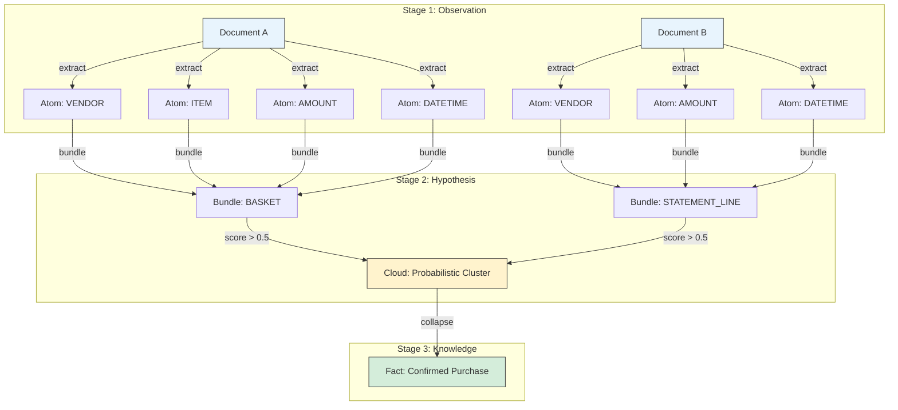
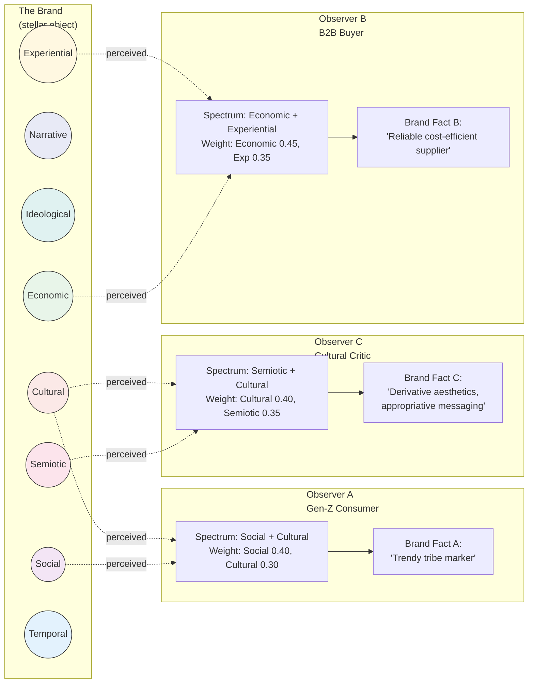
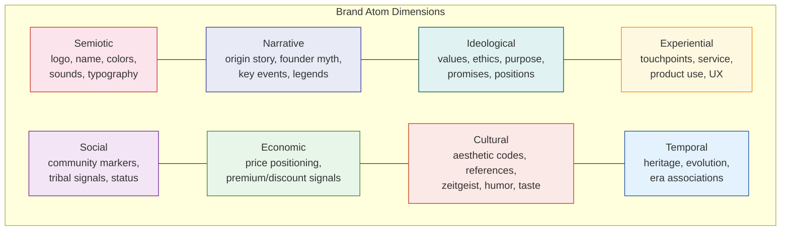
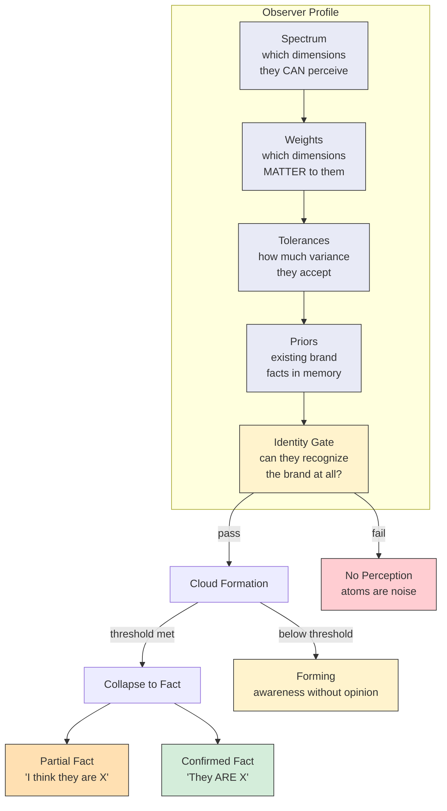
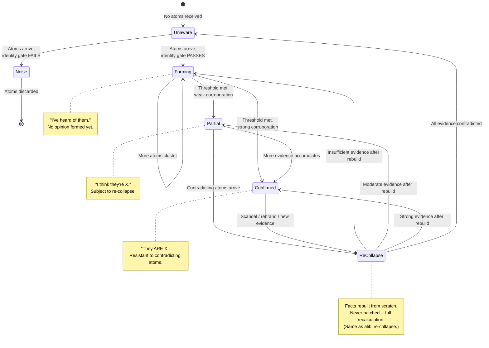
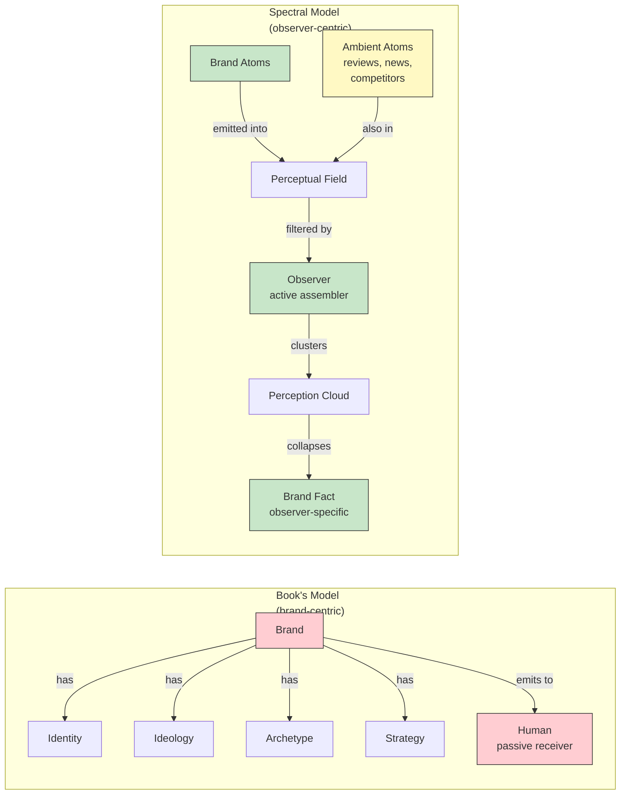
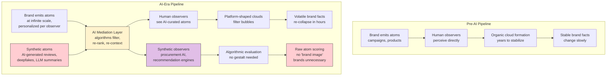
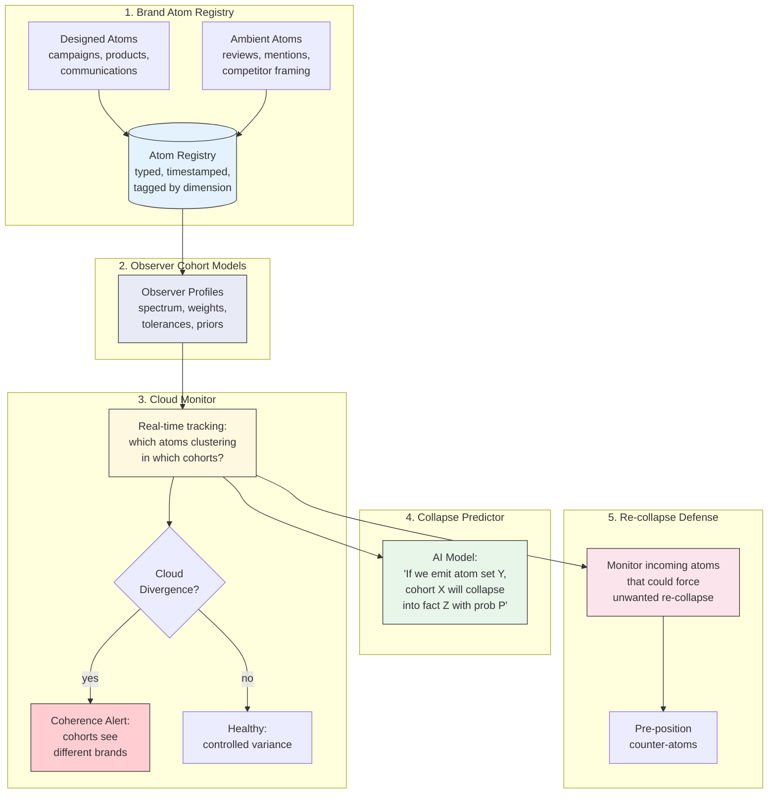
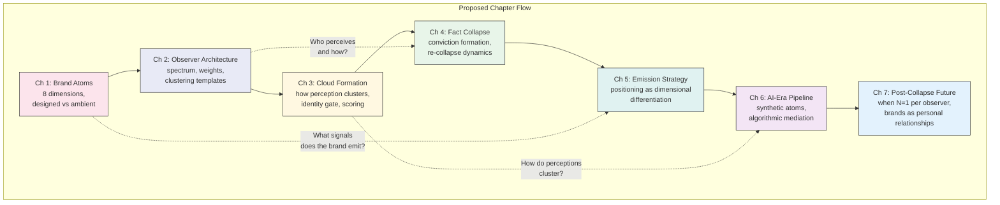
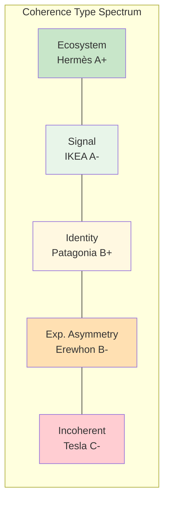

# Spectral Branding Framework

**Version**: 2.0 (Post-Track-0 Validation)
**Status**: Draft
**Last Updated**: 2026-02-27
**Related**: `v2_architecture.md`, `CONTINUATION_PROMPT.md`

---

## Overview

This document applies the atom-cloud-fact epistemological pattern from the alibi project to branding theory. A brand is modeled as a stellar object: composed of brand-atom signals across multiple dimensions, perceived differently by observers with different spectral sensitivities and positions. There is no single brand perception that applies universally across all observers — each cohort assembles structurally different brand meaning from the same signal environment. The brand's signal architecture (what it emits across eight dimensions) can be characterized at the brand level; brand meaning exists only in the minds of those who perceive it.

The framework provides both a critique of traditional branding theory and a practical architecture for AI-era brand management.

---

## Part 1: The Epistemic Pattern

The alibi project implements a three-stage pipeline that models the progression from observation to knowledge. This pattern is domain-agnostic.



Seven architectural principles make this work:

| # | Principle | Alibi Implementation | Domain-Agnostic Form |
|---|-----------|---------------------|---------------------|
| 1 | Dimensional typing | 6 atom types (VENDOR, ITEM, PAYMENT, DATETIME, AMOUNT, TAX) | Observations belong to typed dimensions |
| 2 | Source-bound observation | Atoms belong to exactly one document | No observation claims to see from two places |
| 3 | Hard identity gate | Vendor gate prevents false clustering | Core identity match is a precondition for clustering |
| 4 | Asymmetric tolerances | receipt+statement: 5d, invoice+payment: 60d | Context determines what "close enough" means |
| 5 | Weighted multi-dimensional scoring | vendor 0.30, amount 0.40, date 0.20, items 0.50 bonus | Not all dimensions are equal |
| 6 | Re-collapse on new evidence | Facts rebuilt from scratch, never patched | Truth is recalculated from full evidence set |
| 7 | Epistemic separation | Atoms != Clouds != Facts | Observations != Hypotheses != Knowledge |

---

## Part 2: The Stellar Object Mapping

A brand is a stellar object. The same constellation of stars appears different from every point in the universe, and to every creature with a different range of spectral sensitivity.



| Stellar Concept | Brand Equivalent |
|----------------|-----------------|
| Stars (atoms) composing the object | Brand signals emitted across dimensions |
| Observer's position in the universe | Social/professional/cultural cohort |
| Observer's spectral sensitivity | Values, beliefs, cultural codes, literacy |
| Visible constellation from Earth | Brand-as-perceived by one cohort |
| Same stars seen from Andromeda | Same brand perceived by a different cohort |
| Infrared vs visible vs X-ray | Emotional vs rational vs social perception channels |
| The stellar object itself (all stars, all radiation) | The brand's signal architecture — objectively characterizable across all eight dimensions |

The critical insight: **there is no universal brand perception.** The brand's signal architecture — its eight-dimensional emission pattern — is objectively real and characterizable. What cannot exist in a single universal form is brand *meaning*: each observer cohort assembles structurally different brand meaning from the same signal environment, collapsing whichever atoms they can perceive through their particular spectrum into distinct brand facts.

---

## Part 3: Spectral Branding Architecture

### 3.1 Brand Atom Types (8 Dimensions)



| Dimension | Examples | Alibi Analog |
|-----------|----------|-------------|
| **Semiotic** | Logo, name, colors, sounds, typography, packaging | VENDOR (identification signals) |
| **Narrative** | Origin story, founder myth, key events, brand legends | DATETIME (temporal anchors) |
| **Ideological** | Stated values, ethical positions, purpose, promises | -- (new dimension) |
| **Experiential** | Touchpoints, service moments, product use, UX | ITEM (the actual "stuff") |
| **Social** | Community markers, tribal signals, status codes | PAYMENT (social exchange currency) |
| **Economic** | Price positioning, value signals, premium/discount | AMOUNT (monetary meaning) |
| **Cultural** | Aesthetic codes, references, zeitgeist, humor | TAX (cultural overhead) |
| **Temporal** | Heritage, evolution moments, era associations | DATETIME (when things happened) |

### 3.2 Brand Bundles (Encounter Types)

Each brand encounter produces a typed bundle, analogous to how each document type produces a different bundle in alibi.

| Bundle Type | Channel | Typical Atoms |
|-------------|---------|---------------|
| **CAMPAIGN** | Advertising | semiotic + narrative + cultural + economic |
| **ENCOUNTER** | Store/service visit | experiential + semiotic + social + economic |
| **USAGE** | Product consumption | experiential + economic + temporal |
| **TESTIMONY** | Word-of-mouth / review | narrative + social + ideological |
| **EMPLOYMENT** | Working at the brand | cultural + ideological + social + economic |
| **INVESTMENT** | Financial relationship | economic + narrative + temporal |
| **NEWS** | Media coverage | narrative + cultural + social + ideological |

### 3.3 Observer Model

This is the missing piece in classical branding. In alibi, the system is the sole observer with fixed weights. In branding, **observers are heterogeneous** -- each assembles a different brand from the same atoms.



Example observer profiles:

| Cohort | High-Sensitivity Dims | Primary Weights | Tolerance |
|--------|----------------------|----------------|-----------|
| Gen-Z consumer | social, cultural, semiotic | social: 0.40, cultural: 0.30 | Low for ideological inconsistency |
| B2B buyer | economic, experiential, temporal | economic: 0.40, experiential: 0.35 | High for cultural (irrelevant to them) |
| Brand employee | ideological, cultural, social | ideological: 0.35, cultural: 0.30 | Zero for ideological contradiction |
| Investor | economic, narrative, temporal | economic: 0.45, narrative: 0.30 | High for experiential (not their concern) |
| Cultural critic | semiotic, cultural, narrative | cultural: 0.40, semiotic: 0.35 | Zero for cultural inauthenticity |

### 3.4 Cloud Formation and Fact Collapse

Brand perception follows the same epistemic pipeline as financial facts:



**The Brand Identity Gate** functions like alibi's vendor gate: the observer must first *recognize* these atoms as belonging to the same entity. Logo, name, visual identity serve this function. Without passing the gate, atoms don't cluster -- they are noise.

**Scoring is observer-specific**: unlike alibi's fixed weights, brand cloud formation uses the observer's own weight profile. A Gen-Z consumer clusters by social + cultural. A B2B buyer clusters by economic + experiential. *The same atoms produce different clouds.*

**Re-collapse**: a brand scandal, product failure, or brilliant campaign introduces new atoms that force re-collapse. The brand fact is rebuilt from scratch -- just as in alibi. This explains why some brands recover from scandals (new positive atoms outweigh negative in re-collapse) and some don't (negative atoms dominate).

**Single-bundle collapse**: one devastating news article collapses directly into a fact with no corroboration needed -- same as a standalone receipt in alibi.

---

## Part 4: Critical Analysis of the Book Draft

The book draft ("Brand 3.0") is structured around a traditional branding framework. Through the spectral lens, here is what it gets right, what it misses, and what could be reframed.

### 4.1 What the Book Anticipates

**"Multi-layered cognitive spaces" (Многослойная модель когнитивных пространств)**
The 12 spaces -- media, trade, social, cultural, historical, career, financial, political, health, labor market, military, scientific -- are recognizable as proto-atom-dimensions. This is the strongest concept in the outline. But they are framed as "spaces where the brand exists" rather than **dimensions along which observers perceive**. The brand doesn't "exist in" the cultural space; the cultural dimension is a perceptual channel through which observers register brand atoms.

**"Brand as guiding star" (Бренд как путеводная звезда)**
The stellar metaphor is already present. But the book uses it as a management metaphor (the brand guides the business), not as a perceptual metaphor (the brand IS a stellar object whose appearance depends on the observer). The metaphor should be pushed further.

**"Brand integrity" (Цельность бренда)**
Maps directly to the identity gate + coherence requirement. Consistency across atoms ensures they cluster correctly. Without it, atoms scatter into unrelated clouds and never collapse into a strong fact.

**"Brand as gestalt and attractor" (Бренд как гештальт и аттрактор)**
This is exactly what a collapsed brand fact is. The gestalt is the collapse product. The attractor function is the scoring weight profile that pulls atoms toward clustering.

### 4.2 What the Book Misses



**1. The observer model is absent.**
The entire outline is brand-centric. Every chapter asks "what IS the brand?" (identity, ideology, archetype, strategy). No chapter asks "who is PERCEIVING the brand, and how?" The spectral model requires equal treatment of the observer. Without it, you describe a stellar object without acknowledging it looks different from every point in the universe.

The book mentions "human-brand relationships" (отношения человека с брендом) but frames the human as a passive receiver. The spectral model treats the observer as an **active assembler** -- they select, weight, cluster, and collapse brand atoms through their own perceptual apparatus.

**2. Archetypes are misplaced in the architecture.**
The book treats archetypes (masculine/feminine, Jungian) as foundational brand elements -- atoms of identity. In the spectral model, archetypes are **pre-compiled clustering templates** -- cultural algorithms that tell observers how to assemble brand atoms into recognizable patterns. "The Hero" is not a brand atom; it is a scoring function. It tells the observer: "weight narrative atoms high, look for conflict-resolution patterns, expect ideological atoms about courage." Archetypes belong in the observer model, not the brand model.

**3. Brand types are taxonomic, not structural.**
The book lists types (corporate, product, territorial, social, personal, auxiliary). In the spectral model, these differ not by essence but by **which atom dimensions are dominant**:

| Type | Dominant Dimensions | Primary Observer Cohorts |
|------|--------------------|-----------------------|
| Corporate | ideological, economic, narrative | investors, employees, regulators |
| Product | experiential, economic, semiotic | consumers, retailers |
| Territorial | cultural, temporal, narrative | tourists, residents, investors |
| Personal | social, narrative, ideological | followers, employers, peers |

They are not different species -- they are the same spectral structure with different dimensional emphasis.

**4. The static/dynamic confusion.**
The book frames brand as a *thing* that has properties (identity, ideology, gender). The spectral model frames brand as a *process* -- continuous emission, continuous observation, continuous re-collapse. "Brand identity" is not a fixed property; it is the current collapse state across all observer cohorts. It changes every time new atoms are emitted or new observers arrive.

**5. "When will brands die" is the wrong question.**
Brands cannot "die" in the spectral model because they were never "alive." Atoms can stop being emitted. Observers can stop perceiving. Clouds can dissipate without collapsing. Facts can be re-collapsed into nothing. But there is no single entity that "dies." The better question: **under what conditions do brand atoms stop producing collapse?**

**6. Missing: designed vs ambient atoms.**
The brand controls only a subset of its own atoms. Campaigns, products, communications are *designed atoms*. Reviews, scandals, competitor framing, cultural shifts are *ambient atoms*. This tension -- between designed and ambient -- is where brand management actually happens, and it is absent from the outline.

### 4.3 Reframing the Book's Concepts

| Book Concept | Traditional Frame | Spectral Reframe |
|-------------|-------------------|----------------|
| Brand ideology | What the brand believes | **Emission policy**: rules governing which atoms to generate and which dimensions to prioritize |
| Brand mythology | The brand's story | **Temporal clustering scaffold**: narrative atoms designed to anchor cloud formation in origin-trial-triumph structure |
| Positioning | Where the brand sits in the market | **Dimensional differentiation**: choosing which atom dimensions to dominate so clouds are structurally distinct from competitors |
| Brand architecture | How sub-brands relate | **Identity gate configuration**: monolithic = one gate; house of brands = separate gates; endorsed = shared partial gate |
| Rebranding | Changing the brand | **Forced re-collapse**: disrupting existing facts by changing the identity gate and flooding with new atoms, hoping observers re-collapse into a different fact |
| Brand health research | Measuring brand strength | **Collapse measurement**: what has solidified in observers' minds across cohorts |
| Tone of voice | How the brand speaks | **Atom signature**: consistent dimensional ratios (e.g., always 40% ideological + 30% cultural + 20% social + 10% semiotic in communications) |
| Brand book / guidelines | Rules for consistency | **Atom emission spec**: constraints ensuring emitted atoms pass the identity gate and cluster predictably |

---

## Part 5: AI-Era Spectral Branding

### 5.1 What AI Changes at Each Pipeline Stage



**Atom generation**: AI enables infinite atom generation at near-zero marginal cost. Personalized semiotic, narrative, experiential atoms for every individual observer. This breaks the "one campaign, many observers" model. Danger: atom inflation devalues each individual atom. More atoms does not mean stronger collapse -- it can mean more noise, weaker clustering.

**Observation**: AI observers (recommendation algorithms, search engines, social feeds) mediate between brand atoms and humans. They pre-filter, re-rank, and re-contextualize atoms before human perception. The brand emits atom X, but the algorithm presents atom X' to the human. The brand increasingly does not control what observers actually perceive.

**Cloud formation**: AI-mediated environments create filter bubbles -- artificial constraints on which atoms reach which observers. Brand clouds form differently on TikTok vs LinkedIn vs Amazon not because the brand emits different atoms, but because the platform's AI selects different atom subsets for presentation.

**Fact collapse**: AI accelerates re-collapse cycles. Pre-AI brand facts were stable for years. Now a single viral moment can force re-collapse for millions simultaneously. AI also enables **synthetic facts** -- AI-generated brand perceptions assembled from synthetic atoms (deepfakes, AI reviews). The forgery problem: if brand facts can be assembled from synthetic atoms, what does "brand truth" mean?

### 5.2 Spectral Brand Management System

An AI-era brand management system mirrors alibi's architecture directly:



| System Component | Function | Alibi Analog |
|-----------------|----------|-------------|
| Brand Atom Registry | Track every emission + ambient signal, typed by dimension | Atom storage (documents -> atoms) |
| Observer Cohort Models | Define spectrum, weights, tolerances per cohort | Identity system (canonical entity registry) |
| Cloud Monitor | Track which atoms are clustering in which cohorts | Cloud formation (probabilistic clustering) |
| Collapse Predictor | Predict how new atoms will change facts per cohort | -- (new, AI-native capability) |
| Re-collapse Defense | Detect and buffer against unwanted re-collapse | Re-collapse on new evidence |

### 5.3 Brand as Executable Model

In the AI era, a brand is no longer a "platform document" or "brand book." It is an executable model:

- **Input**: observer profile + context
- **Processing**: atom selection + scoring + clustering
- **Output**: predicted brand fact (what this observer will believe)

Brand management becomes model management:

- **Training data**: all historical atoms + observer responses
- **Loss function**: divergence between intended collapse and actual collapse
- **Optimization**: adjusting atom emission policy to minimize loss

This is not speculative. Personalization engines, dynamic creative optimization, and AI-driven brand tracking are already converging toward this architecture. The spectral model provides the theoretical framework that unifies these operational tools.

### 5.4 The Book's Ultimate Question, Reframed

> "When will brands die?" (Когда умрут бренды?)

Reframed: **When will the atom-to-fact pipeline become unnecessary?**

Answer: when AI observers make all decisions without collapsing atoms into facts. If an AI procurement system evaluates a product on raw atoms (price, specs, reviews) without forming a "brand image," then branding is dead *for that observer*. But as long as human observers need cognitive shortcuts (gestalts, attractors) to navigate choice complexity, the collapse mechanism persists -- and therefore brands persist.

The real threat is not AI replacing brands, but **AI making observers so granular that no two observers collapse the same fact.** When every person has a unique brand fact, the concept of "a brand" (singular, shared) dissolves into N individual brand relationships. The brand as a collective phenomenon dies; the brand as a personal relationship lives.

---

## Part 6: Proposed Book Structure (Spectral Reframe)

| Current Structure | Spectral Structure | Key Shift |
|-------------------|------------------|-----------|
| What is a brand? (definitions) | What are brand atoms? (dimensional typology) | From noun to verb: brand is a process, not a thing |
| Brand identity (ideology, archetypes) | Atom emission policy + observer clustering templates | Archetypes move from brand to observer |
| Strategy (positioning, architecture) | Dimensional differentiation + identity gate design | From "where we sit" to "which atoms we dominate" |
| Management (documentation, health) | Cloud monitoring + collapse prediction | From static audit to real-time pipeline |
| When brands die | When collapse becomes unnecessary | From mortality to phase transition |



The fundamental shift: from describing brands as **objects with properties** to modeling brands as **processes with observers**.

---

## Part 7: Track 0 Exploratory Analysis — Nine Candidate Mechanisms (v2.0)

Track 0 applied the spectral framework to 5 brands (Hermès, IKEA, Patagonia, Tesla, Erewhon) across all 6 modules. The exploratory analysis identified 9 candidate mechanisms that extend the framework beyond its v1.0 specification. These represent analytical observations from five illustrative cases, not empirically validated findings.

### 7.1 Dark Signals: Structural Absence as Brand Dimension Modifier

**Discovery**: Hermès creates value through designed signal RESTRICTION, not amplification. The empty shelf, the wait list, the inability to buy — these are not failures of distribution but strategic acts of structural absence.

**Physics analog**: dark matter — invisible but gravitationally active. Cannot be observed directly but detected through effects on visible signals. Comprises the majority of brand power in scarcity brands.

**Three emission types** (replaces the binary designed/ambient model):

| Type | Mechanism | Signal Present? | Example |
|------|-----------|----------------|---------|
| **Positive** | Brand emits signal, atoms accumulate | Yes | Campaign, product launch |
| **Null** | Signal absent, unintentional | No (neglect) | Dormant dimension, forgotten brand |
| **Structural Absence** | Designed scarcity functions as signal | No (strategy) | Wait list, no discounts, geographic restriction |

**Formal specification**:

```
Standard cloud formation:
  Cloud = Σ(emitted_atoms × weights)

Cloud formation with structural absence:
  Cloud = Σ(emitted_atoms × weights) + Σ(absent_atoms × scarcity_multiplier × weights)
```

**Dimensional constraints**: structural absence operates primarily on social (exclusivity), economic (no discounts), and experiential (geographic scarcity). It cannot operate on semiotic (no "absent logo") or narrative (absence of story is just absence).

**Scale-independent**: the mechanism works identically at $20 (Erewhon smoothie) and $15,000 (Hermès handbag).

### 7.2 Coherence Taxonomy: Five Types of Brand Architecture

**Discovery**: coherence is not a single variable from low to high. It has qualitative TYPES with structurally different resilience properties. A 7/10 Signal Coherence and a 7/10 Ecosystem Coherence would look identical on a traditional scorecard but have fundamentally different properties.



| Type | How Clouds Relate | Resilience Under Disruption | Brand Example |
|------|-------------------|---------------------------|---------------|
| **Ecosystem** | Different clouds reinforce through functional interdependence | Selective — absorbs by purification | Hermès |
| **Signal** | Consistent designed signals → consistent clouds | Uniform — transmits disruption evenly | IKEA |
| **Identity** | Ideological core filters cohort compatibility | Binary — divides along ideology | Patagonia |
| **Experiential Asymmetry** | Evidence gap between local and remote observers | Geographic — different impact by location | Erewhon |
| **Incoherent** | Contradictory signals → irreconcilable clouds | Amplifying — widens existing cracks | Tesla |

### 7.3 Product-Anchored Cohort as Universal Resilience Asset

**Discovery**: confirmed across ALL 5 brands. In every disruption scenario, the cohort with highest experiential weight and evidence-based conviction provides the structural floor. Product-anchored cohorts absorb disruption better because their conviction is built on direct evidence, not ambient signals.

| Brand | Product Cohort | Experiential Weight | Disruption Behavior |
|-------|---------------|-------------------|-------------------|
| Hermès | Heritage Client | 0.30 | Reinforces ("art survives markets") |
| IKEA | Budget Family | 0.30 | Stabilizes ("products still work") |
| Patagonia | Outdoor Purist | 0.30 | Anchors ("gear is still excellent") |
| Tesla | Tech Loyalist | 0.35 | Sole firewall (only unconflicted dimension) |
| Erewhon | Wellness Devotee | 0.35 | Reinforces ("I know the product firsthand") |

### 7.4 Designed/Ambient Goldilocks Zone

**Exploratory hypothesis**: the five-brand comparison suggests a possible optimal designed/ambient signal ratio around 55-65% designed. This is an exploratory hypothesis requiring larger-sample validation.

| Brand | D/A/S Ratio (est.) | Coherence | Assessment |
|-------|-------------------|-----------|------------|
| IKEA | 70/25/5 | 7/10 | Slightly over-designed (lacks organic defenders) |
| Hermès | 60/35/5 | 8/10 | Goldilocks zone + ambient ALIGNMENT |
| Patagonia | 55/40/5 | 4/10 | Zone entry — but ideological split reduces coherence |
| Tesla | 30/65/5 | 2/10 | Critically under-designed (CEO ambient dominance) |
| Erewhon | ~25-40/55-70/5 | 4/10 | Ambient-dominated (brand doesn't control its narrative) |

*D = designed signals; A = ambient signals; S = synthetic/AI-generated and unclassified signals. Ratios are order-of-magnitude estimates (±10-15% uncertainty); a systematic signal audit would be required for precise measurement. Erewhon's wider range reflects divergent estimates across analyses.*

**Key qualifier**: the DIRECTION of ambient signals matters as much as the ratio. Hermès (60/35/5, aligned ambient) outperforms IKEA (70/25/5, passive ambient) because Hermès' ambient signals amplify designed signals rather than merely existing.

### 7.5 Temporal Compounding Curve

**Discovery**: heritage compounds non-linearly. The temporal dimension is the ONLY dimension that competitors cannot replicate and that no disruption can erase.

| Heritage Duration | Structural Role | Brand Example |
|-------------------|---------------|---------------|
| ~10 years | Negligible (currency, not heritage) | Erewhon |
| ~20 years | Supplementary (barely leveraged) | Tesla |
| ~50 years | Moderate (story exists but under-told) | Patagonia |
| ~80 years | Approaching threshold (significant but under-communicated) | IKEA |
| ~180+ years | Foundational architecture (heritage IS the operating system) | Hermès |

**Temporal modes**: heritage (compounds) vs currency (depreciates). Opposite risk profiles.

**Note**: these duration bands are approximate thresholds suggested by the five-brand comparison. They illustrate the mechanism's existence but are not empirically validated boundary conditions; a larger sample would likely refine the inflection points.

### 7.6 Mediated Cloud Formation

**Discovery**: clouds can form via screens without direct product encounter. The observer builds an impression from content, social media, and secondhand accounts — but this impression may never collapse to conviction. It exists in a permanent pre-conviction state.

- **Discovered**: Erewhon Digital Observer (cloud confidence 0.45, permanently forming)
- **Properties**: lower confidence, higher volatility, dual-coded (aspirational + incomplete)
- **Significance**: increasingly the DEFAULT mode for digital-native brand perception

### 7.7 Weight-Barrier-Crossing Signals

**Discovery**: certain signals bypass an observer's dimensional weight filtering. Not all weights are absolute.

- **Discovered**: IKEA case study — child labor scandal activates Budget Family despite 0.05 ideological weight
- **Mechanism**: signal migrates from primary dimension (ideological) to a dimension where the observer IS sensitive (experiential/safety)
- **Implication**: supply chain ethics is an experiential risk, not just an ideological one

### 7.8 Negative Cloud Resilience

**Discovery**: negative clouds STRENGTHEN during brand disruption. Evidence-free negative convictions are more stable than evidence-rich positive ones.

- **Discovered**: Tesla Boycotter (0.82 confidence, zero product experience)
- **Mechanism**: no experiential data to create cognitive dissonance. Brand crises CONFIRM the negative conviction rather than challenging it.
- **Paradox**: the observer with the LEAST evidence has the MOST stable conviction

### 7.9 Brand Health vs Brand Power Inversion

**Discovery**: brand health and brand power are independent variables. Traditional metrics conflate them.

| Brand | Traditional Power | Spectral Health | The Gap |
|-------|------------------|----------------|---------|
| Tesla | Highest (awareness, cultural impact) | Lowest (C-) | Maximum inversion |
| Hermès | Moderate (niche, exclusive) | Highest (A+) | Architecture > awareness |

**Implication**: the framework measures ARCHITECTURE, not AWARENESS. The confusion between brand power and brand health is the central error in traditional brand management.

### 7.10 Non-Ergodic Perception Dynamics

**Discovery**: brand perception operates as a multiplicative, path-dependent, non-ergodic process — and this single property from physics explains multiple independently discovered SBT phenomena.

**Theoretical basis**: Peters, O. (2019). The ergodicity problem in economics. *Nature Physics*, 15, 1216–1221. Peters demonstrates that for 300 years, economics has confused ensemble averages (across many agents at one moment) with time averages (one agent across time). In non-ergodic systems, these diverge. Brand perception is non-ergodic because signals compound multiplicatively (each new signal multiplies existing cloud confidence rather than adding to it), sequence matters (three positive signals then a crisis differs from the reverse), and negative conviction is an absorbing state (once crossed, no future positive signals reach the observer).

**What non-ergodicity explains in SBT**:

| SBT Discovery | Non-Ergodic Explanation |
|---------------|----------------------|
| Brand health != brand power (7.9) | Time average != ensemble average |
| Negative clouds strengthen under disruption (7.8) | Absorbing state — no reversal mechanism |
| Temporal compounding is non-linear (7.5) | Multiplicative path-dependent growth |
| Coherence type determines resilience (7.2) | Ergodicity profile determines which metrics are reliable |
| D/A ratio predicts controllability (7.4) | High D/A = more ergodic (controllable), low D/A = more non-ergodic (chaotic) |
| Evidence-free conviction > evidence-rich (7.8) | Non-ergodic trajectory without experiential friction |

**Proposed metric — Ergodicity Coefficient (epsilon)**:

```
epsilon(brand, dimension) in [0, 1]
epsilon = 1.0 -> ergodic: ensemble surveys reliable
epsilon -> 0.0 -> non-ergodic: must track cohort trajectories
```

**Practical implication**: before choosing a measurement approach, assess the ergodicity profile. Ecosystem-coherent brands (high epsilon) can use aggregate surveys. Incoherent brands (low epsilon) require longitudinal cohort tracking — their dashboards are averaging divergent trajectories into a statistical phantom.

### 7.11 Cross-Model Pipeline Robustness

**Finding**: the analytical pipeline produces consistent structural diagnoses when executed by different LLMs (Claude Opus 4.6 and Gemini 3.1 Pro). This demonstrates prompt consistency and internal reproducibility — not empirical validity. Two LLMs trained on similar internet corpora about the same five well-documented brands producing similar outputs shows that the framework is specified precisely enough to constrain LLM analysis; it does not show that those outputs accurately represent real consumer perception processes.

**Cross-model replication** (all 5 brands × 6 modules):

| Brand | Claude Opus 4.6 | Gemini 3.1 Pro | Convergence |
|-------|----------------|----------------|-------------|
| Tesla | Incoherent, C- | Incoherent, C- | Identical |
| Hermès | Ecosystem, A+ | Ecosystem, A+ | Identical |
| Patagonia | Identity, B+ | Identity, B+ | Identical |
| IKEA | Signal, A- | Signal, A- | Identical |
| Erewhon | Exp. Asymmetry, B- | Exp. Asymmetry, B- | Identical |

5/5 brands: identical coherence type + identical grade. Both models independently derived structural absence (Hermès) and CEO ambient domination (Tesla) without these being named in prompts.

**Model-sensitive** (varies by LLM, does not affect structural diagnosis):
- Cohort granularity: Claude Opus 4.6 atomizes (5-6 cohorts), Gemini 3.1 Pro synthesizes (3 cohorts) — consistent across all 5 brands
- D/A ratio: within 10-15 percentage points (Gemini attributes slightly more to designed signals)
- Narrative style: Claude emphasizes paradoxes; Gemini is more operationally clinical

**Implication**: the framework acts as a structured lens that constrains LLM analysis toward consistent analytical conclusions regardless of which model holds the lens. Different models produce different *resolution* but the same *structure* — like telescopes of different apertures viewing the same constellation. Running the pipeline with multiple models is a recommended practice for maximum analytical depth and cross-checking of structural diagnoses.

---

## Part 8: Current Validation Status

### What the LLM-based analysis demonstrates

1. **Internal consistency**: the same structured prompts produce replicable outputs. The five-brand analysis can be reproduced exactly by any analyst using the same prompts — a prerequisite for a useful analytical tool.

2. **Illustrative power**: the framework produces non-obvious structural insights for well-known brands. Structural absence (Hermès), CEO ambient domination (Tesla), and mediated cloud formation (Erewhon) emerged from the analytical process without being seeded in prompts.

3. **Pedagogical utility**: the five brand analyses communicate the framework's mechanisms more clearly than abstract descriptions alone. The case studies are effective teaching material for the framework's concepts.

### What the LLM-based analysis does NOT demonstrate

1. **Empirical accuracy of observer weights**: the dimensional weights assigned to observer cohorts are expert estimates by the framework's author. They have not been validated against actual consumer data (surveys, conjoint analysis, MaxDiff). Two analysts with different intuitions about observer weights may produce different coherence diagnoses.

2. **Predictive validity**: no outcome has been tested against real consumer behavior. The framework has not predicted a brand event before it occurred and confirmed the prediction.

3. **Generalizability**: the five brands were selected because they are among the most analyzed brands in the world and because they illustrate structurally different architectures. This selection bias means the nine candidate mechanisms may not generalize to less-documented brands.

4. **What cross-model replication proves**: identical outputs from Claude and Gemini demonstrate prompt consistency, not theoretical validity. Both models were trained on similar internet corpora containing extensive analysis of these five brands. Agreement between models reflects shared training data and identical structured prompts — not independent confirmation of real consumer perceptions.

### What empirical validation would look like

1. **Dimensional validity study**: survey instruments measuring the importance of each of the 8 dimensions to real consumer cohorts. Do consumers weight semiotic, narrative, temporal, and other dimensions in ways consistent with the framework's expert estimates?

2. **Observer weight conjoint study**: conjoint analysis or MaxDiff methodology to replace expert-estimated dimensional weights with measured consumer preference weights.

3. **Conviction collapse longitudinal panel**: panel study tracking the same cohort through a brand crisis, measuring when and how perception clouds shift toward conviction (collapse) or dissolution.

4. **Cohort discovery research**: cluster analysis of real consumer spectral profiles to test whether the framework's proposed cohort structures emerge from actual consumer data or are imposed by the analytical process.

### Current epistemic status

SBT is a formally specified analytical framework with explicit constructs, mechanisms, and candidate hypotheses. The five-brand exploratory analysis demonstrates the framework's internal consistency and illustrative power. Empirical validation — required to confirm the framework's claims about real consumer perception processes — remains future work.

This is the standard intermediate stage for theoretical frameworks: formal specification → testable hypotheses → empirical validation. SBT is at stage two. The Research Program (added in a future session) specifies the H1–H5 hypotheses and the validation agenda.

---

## References

**Source architecture**: `v2_architecture.md` -- Atom-Cloud-Fact pipeline
**Implementation**: `alibi/atoms/parser.py`, `alibi/clouds/formation.py`, `alibi/clouds/collapse.py`
**Identity system**: `alibi/identities/matching.py`
