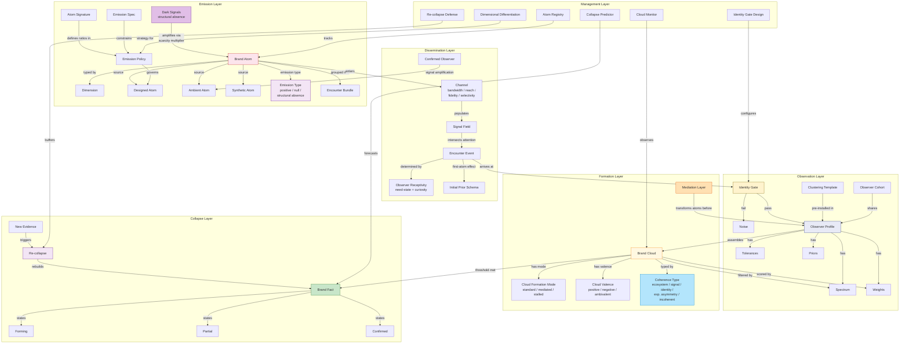
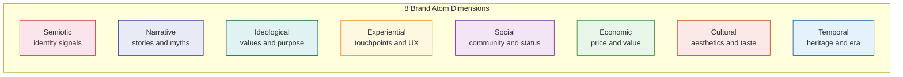
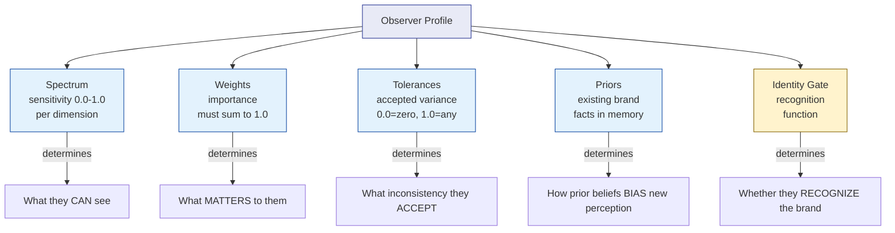
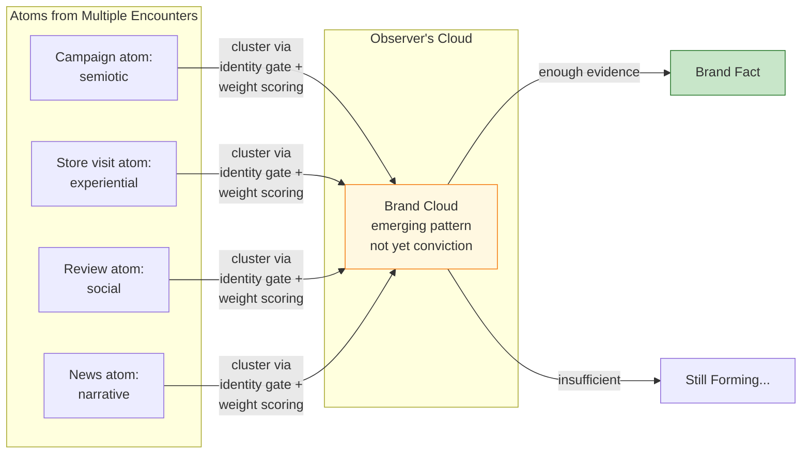
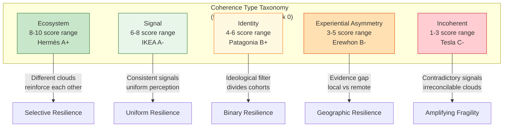
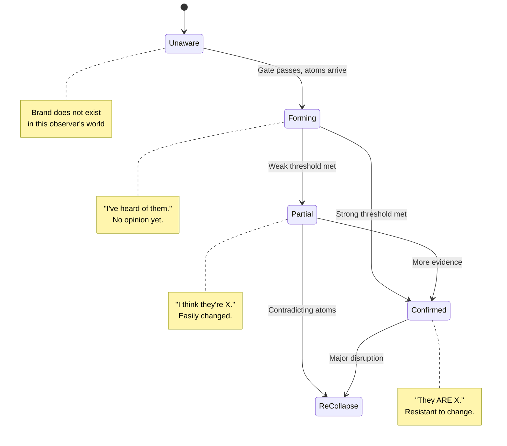

# Spectral Brand Theory: Glossary

**Version**: 2.0 (Post-Track-0 Validation)
**Status**: Draft
**Last Updated**: 2026-02-27
**Related**: `FRAMEWORK.md`

### v2.0 Additions (Track 0 Discoveries)
- **Dark Signals / Structural Absence**: value creation through designed signal restriction
- **Emission Type Taxonomy**: positive, null, structural absence
- **Coherence Type Taxonomy**: ecosystem, signal, identity, experiential asymmetry, incoherent
- **Temporal Mode**: heritage vs currency
- **Cloud Formation Mode**: standard, mediated, stalled
- **Cloud Valence**: positive, negative, ambivalent
- **Weight-Barrier-Crossing Signal**: signals that bypass dimensional filtering
- **Scarcity Multiplier**: amplification of positive signals by structural absence

### v2.1 Additions (Non-Ergodic Perception)
- **Non-Ergodic Perception**: brand perception as a multiplicative, path-dependent process
- **Ergodicity Coefficient**: per-dimension measure of ensemble metric reliability
- **Absorbing State**: irreversible negative conviction basin

### v2.2 Additions (Signal Dissemination Layer)
- **Signal Field**: spatiotemporal set of brand atoms in a given environment
- **Channel**: medium through which atoms travel from emission to signal field (bandwidth, reach, fidelity, selectivity)
- **Encounter Event**: moment atoms intersect observer's attention
- **Observer Receptivity**: pre-perception property (need-state activation + curiosity threshold)
- **Gate Friction**: number of encounters required to open a closed identity gate
- **Signal Amplification**: Confirmed observers becoming secondary emitters
- **First-Atom Effect**: disproportionate impact of the first brand atom encountered
- **Field Density**: brand atoms per unit of observer attention in a signal field
- **Cohort Addressability**: set of channels that can deliver atoms to a given cohort's signal field

---

## Overview

Comprehensive glossary of Spectral Brand Theory (SBT) terminology. Terms are organized by conceptual layer (emission, observation, formation, collapse, management) with cross-references and relationship diagrams.

---

## Term Relationship Map

---

## Foundational

### Brand

In SBT, a brand operates at two analyzable levels: its *signal architecture* (what it emits across eight dimensions — objectively characterizable at the brand level) and its *brand meaning* (what observer cohorts collapse from those signals — observer-specific and cohort-variable). The brand is a perceptual process: continuous signal emission, continuous observation through observer-specific spectral profiles, continuous re-collapse into conviction. There is no universal brand perception that applies across all observer cohorts — each cohort assembles structurally different brand meaning from the same signal environment.

- **Key shift**: from noun to verb — brand is something that *happens*, not something that *is*
- **Implication**: brand *meaning* is observer-specific (no two cohorts perceive the same brand meaning); brand *signal architecture* is characterizable at the brand level and is the objective input to the perceptual analysis
- **See**: Brand Atom, Brand Cloud, Brand Fact, Conviction Collapse, Observer Cohort

---

## Emission Layer

### Brand Atom

The irreducible unit of brand meaning. A discrete signal emitted by or about a brand, typed by one of 8 dimensions. Analogous to an atom in the alibi project (a typed observation extracted from a document).

- **Properties**: dimension (type), source (designed/ambient/synthetic), channel, timestamp, content
- **Key principle**: atoms are source-bound -- each originates from one encounter or event
- **Terminology note**: In the articles and paper, brand atoms are referred to as 'signals' or 'brand signals.' The terms are synonymous: an atom/signal is a single typed contribution to a brand's emission field.
- **See also**: Dimension, Designed Atom, Ambient Atom, Encounter Bundle

### Dimension

One of 8 typed channels through which brand atoms are classified. Each dimension captures a distinct facet of brand meaning.

| Dimension | What It Captures | Examples |
|-----------|-----------------|----------|
| **Semiotic** | Visual and auditory identity signals | Logo, name, colors, sounds, typography, packaging |
| **Narrative** | Stories, myths, temporal structures | Origin story, founder myth, key events, future vision |
| **Ideological** | Values, ethics, purpose, positions | Stated values, ethical stances, promises, transparency |
| **Experiential** | Touchpoints, interactions, product encounters | Product use, service quality, digital UX, failure recovery |
| **Social** | Community, status, belonging signals | Tribe markers, status signals, peer endorsement, rituals |
| **Economic** | Price, value, financial signals | Price point, value proposition, premium signal, discounts |
| **Cultural** | Aesthetic codes, references, taste | Design sensibility, cultural allusions, humor, zeitgeist |
| **Temporal** | Heritage, evolution, era associations | Brand age, nostalgia, trend position, longevity signal |

**Ordering note**: two orderings of the eight dimensions exist and are both valid. (a) Conceptual order for theory and articles: semiotic, narrative, ideological, experiential, social, economic, cultural, temporal — this order groups dimensions by their epistemological role in the perception pipeline. (b) Spectral wavelength order for visual identity (website): semiotic (violet), narrative (indigo), temporal (blue), ideological (teal), economic (green), experiential (amber), cultural (orange), social (red) — this order follows the physical wavelength sequence of the visible spectrum and governs all website and design system renderings. When consuming articles and analytical content, use order (a); when working with visual identity or design assets, use order (b).

### Designed Atom

A brand atom intentionally created and emitted by the brand. The brand has direct control over these atoms.

- **Examples**: advertising campaigns, product design, packaging, official communications, store design
- **Contrast with**: Ambient Atom, Synthetic Atom
- **Key insight**: brands control only a fraction of their total atom output

### Ambient Atom

A brand atom generated by the environment, not by the brand itself. The brand has no direct control over these atoms but must manage their effects.

- **Examples**: customer reviews, news coverage, competitor framing, cultural shifts, word-of-mouth
- **Key insight**: the tension between designed and ambient atoms is where brand management actually happens

### Synthetic Atom

A brand atom generated by AI systems. May be designed (brand uses AI for content) or ambient (AI-generated reviews, deepfakes, LLM summaries about the brand).

- **Examples**: AI-generated ads, synthetic reviews, LLM brand evaluations, deepfake endorsements
- **Key insight**: synthetic atoms create the "forgery problem" -- brand facts assembled from signals no human created
- **See also**: Mediation Layer

### Designed/Ambient Ratio (D/A Ratio)

The proportion of a brand's signal environment that is intentionally designed versus generated by the external environment. A structural diagnostic of how much control the brand exercises over what observers actually receive.

**Three-part composition**: the full signal environment divides into three source categories that sum to 100%:
- **Designed (D)**: brand-controlled atoms — campaigns, product design, official communications, store environments
- **Ambient (A)**: externally generated atoms the brand does not control — reviews, news coverage, competitor framing, cultural commentary, CEO public behavior
- **Synthetic (S)**: AI-generated atoms — LLM summaries, synthetic reviews, algorithmic recommendations, deepfakes

**Exploratory optimal zone hypothesis**: the five-brand comparison suggests a possible optimal designed signal proportion around 55-65%. Within this zone, the brand maintains sufficient control to steer perception while retaining enough organic, uncontrolled signal to generate authentic ambient validation. Outside this zone: brands above ~70% designed risk appearing over-engineered and lack genuine ambient defenders; brands below ~40% designed have lost effective control of their narrative.

**Strategic interpretation**: D/A < 0.40 (designed signals below 40% of the total environment) is a structural problem that communication alone cannot solve. Adding more designed signals when ambient signals dominate only dilutes, rather than corrects, the signal environment. The structural fix requires reducing ambient contamination at source, not increasing designed output volume.

**Key qualifier**: the direction of ambient signals matters as much as the ratio. A brand with 35% ambient but strongly aligned ambient (e.g., Hermès' earned exclusivity) outperforms a brand with 25% ambient that is passive and neutral. High ambient volume with amplifying direction is structurally different from high ambient volume with contradictory direction.

- **Exploratory hypothesis status**: the Goldilocks zone (55-65%) is derived from five illustrative cases. Larger-sample empirical validation is required. See Part 7.4 and H1.
- **See also**: Designed Atom, Ambient Atom, Synthetic Atom, Structural Absence, H1 (Part 9)

### Encounter Bundle

A coherent group of brand atoms from a single encounter or channel. Analogous to a bundle in alibi (a group of atoms from one document).

| Bundle Type | Channel | Typical Dimensions |
|-------------|---------|-------------------|
| CAMPAIGN | Advertising, sponsored content | semiotic, narrative, cultural, economic |
| ENCOUNTER | Store/service visit | experiential, semiotic, social, economic |
| USAGE | Product consumption, service use | experiential, economic, temporal |
| TESTIMONY | Word-of-mouth, reviews | narrative, social, ideological |
| EMPLOYMENT | Working at the brand | cultural, ideological, social, economic |
| INVESTMENT | Financial relationship | economic, narrative, temporal |
| NEWS | Media coverage, journalism | narrative, cultural, social, ideological |

### Emission Policy

The set of rules governing which brand atoms the brand intentionally generates and which dimensions it prioritizes. Replaces the traditional concept of "brand ideology" in SBT.

- **Traditional equivalent**: brand ideology, brand values, brand purpose
- **Key difference**: emission policy is operational (what to emit), not philosophical (what to believe)

### Atom Signature

The consistent dimensional ratio in a brand's communications. Defines the relative proportions of atom types the brand emits. Replaces "tone of voice" in SBT.

- **Example**: "40% ideological + 30% cultural + 20% social + 10% semiotic" for a purpose-driven brand
- **Key principle**: signature consistency is what makes atoms cluster predictably across encounters

### Emission Spec

The operational document constraining atom emission to ensure atoms pass the identity gate and cluster predictably. Replaces "brand book / brand guidelines" in SBT.

### Emission Type (v2.0)

Classification of how a brand atom relates to signal presence or absence. Three types:

| Type | Mechanism | Example | Physics Analog |
|------|-----------|---------|---------------|
| **Positive** | Signal present, atoms accumulate | Campaign, product launch, social post | Normal matter (visible) |
| **Null** | Signal absent, unintentional | Brand goes silent, forgotten, dormant dimension | Vacuum (zero mass) |
| **Structural Absence** | Designed scarcity as signal | Empty shelf, wait list, no discounts, geographic restriction | Dark matter (invisible but gravitationally active) |

- **Key insight**: null emission and structural absence look identical from the outside (both are "nothing happening"). The difference is INTENT: null is negligence, structural absence is strategy.
- **See also**: Dark Signals, Scarcity Multiplier

### Dark Signals (v2.0)

The accessible name for the **structural absence** mechanism: designed signal restriction that creates value through what is NOT there. Like dark matter in physics -- invisible but gravitationally active, shaping the perception field without being directly observable.

- **Formal name**: structural absence
- **Discovered**: Track 0, Hermès case study (A+)
- **Confirmed**: Track 0, Erewhon case study (B-) at $20 price point
- **Dimensional specificity**: operates primarily on social (exclusivity), economic (no discounts), experiential (geographic scarcity). CANNOT operate on semiotic (no "absent logo") or narrative (absence of story is just absence).
- **Scale-independent**: works identically at $20 (Erewhon smoothie) and $15,000 (Hermès handbag)
- **Key examples**: Hermès wait lists, no online Birkin sales, never discounting, limited stores (~300 worldwide). The empty shelf IS the signal.
- **Mechanism**: structural absence amplifies the perceived weight of present signals through contrast — absent signals do not contribute additive values but multiply the interpretive weight of present signals on affected dimensions. See: Scarcity Multiplier.
- **See also**: Structural Absence, Scarcity Multiplier, Emission Type

### Structural Absence (v2.0)

The formal name for the **dark signals** mechanism. Designed scarcity that functions as a brand signal, creating a gravitational well that amplifies the perceived weight of existing positive atoms.

- **Not antimatter**: structural absence does NOT cancel positive signals. It AMPLIFIES them through contrast. The physics analog is dark matter (invisible, structurally essential), not antimatter (opposite charge, annihilates).
- **Properties**: (1) cannot be observed directly, (2) detected through effects on visible signals, (3) comprises a significant portion of brand power in scarcity brands, (4) invisible but structurally essential
- **See also**: Dark Signals, Scarcity Multiplier

### Scarcity Multiplier (v2.0)

A conceptual amplification mechanism by which structural absence increases the perceived weight of present signals on affected dimensions. When a brand restricts access (economic, experiential, social), the present signals on those dimensions are perceived as more valuable through contrast.

- **Not currently quantified**: formalizing the scarcity multiplier as a measurable parameter is on the research agenda. The multiplier levels (1.1–2.5x+) represent conceptual characterizations, not empirically calibrated values.
- **Mechanism**: the amplification is not additive (absent signals do not contribute quantitative values) but multiplicative in perception — restriction creates contrast, which increases the interpretive weight per unit of present signal
- **Example**: Hermès' refusal to discount (economic structural absence) amplifies the economic signal of each product sold. The price becomes proof of value because it never drops.
- **See also**: Dark Signals, Structural Absence, Emission Type

### Temporal Mode (v2.0)

The brand's relationship with the temporal dimension. Two primary modes with opposite risk profiles:

| Mode | Mechanism | Risk | Example |
|------|-----------|------|---------|
| **Heritage** | Draws value from accumulated history | Irrelevance (losing contemporary connection) | Hermès (187 years, foundational) |
| **Currency** | Draws value from present-moment cultural relevance | Expiration (losing relevance when trend passes) | Erewhon (~10 years, culturally current) |
| **Dormant** | Temporal dimension inactive/under-leveraged | Missed defensive asset | Tesla (20+ years, ignored) |

- **Discovered**: Track 0, Erewhon vs Hermès comparison
- **Heritage compounding curve**: non-linear. 20yr = supplementary → 50yr = moderate → 80yr = approaching threshold → 180yr+ = foundational architecture
- **Key insight**: heritage is the ONLY dimension competitors cannot replicate and no disruption can erase

---

## Dissemination Layer

The layer between emission and observation. Models how emitted atoms reach observers' environments and produce encounter events. See FRAMEWORK.md §3.5.

### Signal Field

The set of brand atoms present in a given spatiotemporal environment. A brand's signal field in one city differs from another. A brand's field on one platform differs from another. Not all emitted atoms populate all fields.

- **Field density**: the number of brand atoms per unit of observer attention in a given signal field. High density = high encounter probability.
- Signal fields are populated by channels and depleted by signal decay (atoms fade over time).

### Channel

The medium through which atoms travel from emission to signal field. Channels are distinct from encounter modes: a channel delivers atoms to the environment; encounter mode (direct/mediated/stalled) describes how the observer processes them.

**Channel properties**:
- **Bandwidth**: how many atoms the channel can carry (billboard = few; social media = many)
- **Reach**: how many signal fields the channel populates (local signage = one field; viral content = millions)
- **Fidelity**: how accurately the channel preserves emitted atoms' dimensional content (direct experience = high; word-of-mouth = low, dimension-selective)
- **Selectivity**: whether the channel targets specific cohorts or broadcasts broadly

### Encounter Event

The moment brand atoms in a signal field intersect an observer's attention. Governed by field density, observer receptivity, attention allocation, and algorithmic mediation. The encounter event is the bridge from dissemination to perception -- it triggers the identity gate.

### Observer Receptivity

A pre-perception property of the observer that determines whether encountered atoms are processed or ignored. Two components:

- **Need-state activation**: Does the observer have an active Category Need? (Maps to Rossiter & Percy 1987.) Without need-state, atoms may be encountered but not processed.
- **Curiosity threshold**: Will the observer process novel atoms even without active need? (Maps to Ehrenberg's trial-by-curiosity and Zajonc's 1968 mere exposure effect.)

### Gate Friction

The resistance to opening a closed identity gate, measured as the number of encounter events required to transition from gate-Closed to gate-Open. Determined by:

- **Distinctive asset strength**: how recognizable are the brand's non-name cues (Romaniuk & Sharp 2016)
- **Exposure frequency**: how many encounters before gate transitions (Zajonc mere exposure curve: peak at 10-20 exposures)
- **Signal salience**: can barrier-crossing signals force the gate open in fewer encounters?
- **Cohort-specific factors**: some cohorts have higher gate friction for certain brand categories

### Signal Amplification

The mechanism by which Confirmed observers become secondary emitters, creating new ambient atoms in new signal fields. A feedback loop from perception back to dissemination. Forms include word-of-mouth, social sharing, visible product use, reviews.

### First-Atom Effect

The disproportionate impact of the first brand atom an observer encounters. Creates the initial prior schema through which all subsequent atoms are filtered (Bartlett 1932, anchoring bias). The first atom determines the dimensional emphasis of the initial spectral profile.

### Cohort Addressability

For a given observer cohort, the set of channels that can deliver atoms to their signal field. A cohort is "addressable" through channels where they allocate attention. Determines the practical ceiling on acquisition for that cohort.

### Dissemination States

Per observer × brand, preceding the perception state machine:

| State | Description |
|---|---|
| **Absent** | No brand atoms in observer's signal field |
| **Present** | Atoms in field, no encounter event yet |
| **Encountered** | At least one encounter event — enters perception pipeline |

---

## Observation Layer

### Observer Profile

The formal model of an observer's perceptual apparatus. Defines HOW a specific observer (or cohort) assembles brand atoms into meaning.

- **Five components**: spectrum, weights, tolerances, priors, identity gate
- **Key principle**: different observers with different profiles assemble different brand facts from identical atoms
- **Weight re-normalization rule**: when a dimension is outside an observer's spectrum (sensitivity = 0.0), that dimension's weight is set to zero. The remaining weights are re-normalized to sum to 1.0, concentrating perceptual weighting on the observable dimensions. *Example*: an observer whose spectrum includes {social, economic, experiential} and whose original weights are {social: 0.40, economic: 0.30, experiential: 0.30} uses those weights as-is (they sum to 1.0). An observer whose spectrum EXCLUDES cultural (originally assigned 0.15) drops that weight and re-normalizes the remaining seven weights proportionally — each multiplied by 1/0.85 — so the total returns to 1.0. The practical effect: spectrum exclusion concentrates the observer's weighting on fewer dimensions, potentially amplifying those dimensions' influence on cloud formation.
- **See also**: Observer Cohort, Spectrum, Weights, Tolerances, Priors

### Spectrum

The observer's sensitivity to each of the 8 brand atom dimensions. Ranges from 0.0 (invisible -- cannot perceive this dimension) to 1.0 (full sensitivity). Determines WHAT the observer can see.

- **Example**: a Gen-Z consumer has high sensitivity to social (0.9) and cultural (0.8) atoms, low sensitivity to temporal (0.2)
- **Analogy**: like different species seeing different wavelengths of light. Some animals see infrared, others see ultraviolet, none see all

### Weights

The importance the observer assigns to each dimension, governing how atoms influence cloud formation. Must sum to 1.0. Determines what MATTERS to the observer.

- **Distinction from spectrum**: spectrum = can you see it; weights = does it matter to you. You might see economic atoms (spectrum: 0.7) but not care about them (weight: 0.05)
- **Estimation in practice**: weights are estimated through structured expert judgment informed by behavioral data (stated purchase drivers, revealed preferences, complaint/praise patterns). Treat as hypotheses, not measurements. Validated approaches: conjoint analysis or MaxDiff scaling. Expert estimates carry ±0.10-0.15 uncertainty. See Part 3.3 for methodology.

### Tolerances

The amount of variance or inconsistency the observer accepts before atoms fail to cluster or trigger re-collapse. Ranges from 0.0 (zero tolerance) to 1.0 (anything goes).

- **Example**: brand employees have zero tolerance (0.0) for ideological inconsistency between the brand's stated values and its workplace practices

### Priors

Existing brand facts already collapsed in the observer's memory. Priors do not merely *bias* brand perception — they are its **substrate**. The brand exists in the observer's mind AS their crystallized prior. Without priors, there is only raw signal processing: no accumulated meaning, no loyalty, no equity in the psychological sense. An observer encountering a brand signal without any prior must evaluate it as entirely novel input. An observer with a crystallized prior evaluates only the *delta* — the difference between the incoming signal and their existing brand fact.

- **Key dynamic**: strong priors (confirmed facts) resist contradicting atoms; weak priors (partial facts) are easily reshaped
- **Why priors exist — cognitive efficiency**: the brain does not re-render the full perceptual scene at every moment. It generates a prediction from existing knowledge and processes only the prediction error — the discrepancy between expectation and reality. This is computationally orders of magnitude cheaper than full re-evaluation from raw input (Rao & Ballard, 1999; Friston, 2005). Priors are the mechanism by which accumulated knowledge is compressed into a prediction, so that new signals can be processed as diffs against that prediction, not as novel raw input
- **Visual system parallel**: the retina transmits approximately 10 MB/s of raw signal to the brain, but only ~40 bits/s reaches conscious perception — a compression ratio of roughly 250,000:1 (Sterling & Laughlin, 2015). The brain achieves this by processing *changes* in the visual field (prediction errors), not the whole scene. What we perceive as stable, continuous vision is a construction from sparse updates against a prior model of the world. Brand perception follows the same architecture: observers do not reprocess every past brand encounter at each new signal — they maintain a compressed brand fact and update it at the margin
- **LLM analogy**: large language models achieve similar compression — they encode vast training corpora into weight distributions (priors) and process new tokens as incremental context against those weights, not by re-reading all training data. Human memory is not identical to LLM inference, but the compression principle is analogous: both systems trade perfect recall of all evidence for efficient processing of new input
- **Bayesian formalization**: the brain is a Bayesian inference machine — it maintains probability distributions over world states (priors) and updates them as new sensory evidence arrives. Posterior belief = prior belief × likelihood of new evidence. This means new signals are never processed "cleanly" — they are always weighted against the accumulated prior (Knill & Pouget, 2004). Strong priors require proportionally strong disconfirming evidence to shift. This is not irrationality; it is statistically optimal behavior under resource constraints
- **Schema compression** (Bartlett, 1932): memory does not store raw records of experience but reconstructs them from compressed schemas — structured knowledge templates. New information is assimilated into existing schemas before it is evaluated independently. This is why first encounters disproportionately shape brand perception: the first encounter *creates* the schema; all subsequent encounters are evaluated relative to it
- **Confirmation bias as prior protection**: once a prior is crystallized, contradicting evidence faces a systematic headwind — it must overcome not just its own weakness but the prior's active resistance (Nickerson, 1998). This is not a processing error; it is Bayesian updating operating as designed. The prior encodes more total evidence than any single new atom. Rational updating gives more weight to the prior than to any single counter-signal. Brand crises fail to shift strong brand facts for exactly this reason
- **Without priors — the counterfactual**: an observer with no priors would need to re-evaluate all past brand encounters from scratch at every new signal exposure — computationally impossible for human memory systems, which cannot store or replay raw event records at will. The consequence: without crystallized priors, there is no accumulated brand meaning, no loyalty, no stable brand identity in the observer's mind. Brand strategy would be entirely in-the-moment: each encounter evaluated fresh, no equity accumulation possible. Priors are what make brands a strategic asset rather than a sequence of disconnected impressions
- **Objective vs belief-weighted processing**: the alibi system (financial audit) operates without priors — every re-collapse uses the full accumulated evidence record, which is objectively stored and replayable. Human brand perception cannot do this: memory is reconstructive, not reproductive (Bartlett, 1932), and prior convictions modulate evidence evaluation before conscious assessment. This is the fundamental reason SBT extends the alibi model with a prior layer: removing it would be psychologically inaccurate
- **See also**: Crystallization Threshold, Absorbing State, Re-collapse, Conviction Collapse, Non-Ergodic Perception

*Citations note: Rao & Ballard (1999) — Nature Neuroscience 2(1), 79–87; Friston (2005) — Philosophical Transactions of the Royal Society B, 360, 815–836; Knill & Pouget (2004) — Trends in Neurosciences 27(12), 712–719; Sterling & Laughlin (2015) — Principles of Neural Design, MIT Press; Bartlett (1932) — Remembering, Cambridge University Press; Nickerson (1998) — Review of General Psychology 2(2), 175–220. Verify before academic use.*

### Identity Gate

The precondition for all brand perception: can the observer recognize these atoms as belonging to a specific brand? Analogous to the vendor gate in alibi (the hard constraint that two bundles must match on vendor identity to cluster).

- **What passes the gate**: logo, brand name, distinctive visual identity, sonic identity
- **What happens on failure**: atoms are perceived as noise, not attributed to any brand, no cloud forms
- **Key insight**: brand awareness = gate permeability. Byron Sharp's "mental availability" = how many observers' gates this brand can pass

### Observer Cohort

A cluster in spectral-profile space: a group of observers whose profiles (spectrum, weights, tolerances, priors, gate state) are similar enough that they form structurally similar perception clouds from the same signal environment. The same brand produces similar clouds within a cohort but different clouds across cohorts.

- **Examples**: Gen-Z consumers, B2B procurement buyers, brand employees, investors, cultural critics
- **Key distinction**: cohorts are perceptual groupings, not demographic segments. Two observers from different demographics can share a cohort if their spectral profiles are similar; two observers from the same demographic can belong to different cohorts if their priors diverge
- **Dynamic membership**: cohort membership shifts over time as priors evolve through signal accumulation, decay, and crystallization. Differential signal exposure (encounter mode, geography, media consumption) causes observers to drift between cohorts. Signal events (CEO controversy, product crisis) redistribute observers across cohort boundaries
- **Cohort boundaries**: fuzzy, not categorical. An observer near the boundary between two cohorts produces clouds that blend properties of both
- **Key principle**: a person can shift between cohort profiles contextually (consumer on Saturday, investor on Monday) AND longitudinally (prior evolution over months or years)

### Clustering Template

A pre-compiled set of instructions, installed by culture, that tells observers how to assemble brand atoms into recognizable patterns. Replaces "archetypes" in SBT.

- **Traditional equivalent**: Jungian archetypes (Hero, Explorer, Sage, etc.)
- **Key reframe**: archetypes are NOT brand properties -- they are observer functions. "The Hero" is not what the brand IS; it's a set of scoring rules pre-installed in observers that says "weight narrative atoms high, look for conflict-resolution patterns, expect ideological atoms about courage"
- **See also**: Observer Profile

### Mediation Layer

The AI algorithms and platform systems that filter, re-rank, and re-contextualize brand atoms before they reach human observers. A pipeline stage unique to the AI era.

- **Examples**: social media recommendation algorithms, search engine ranking, e-commerce product placement, content curation AI
- **Key insight**: the brand emits atom X, but the mediation layer presents atom X' to the observer. The brand increasingly does not control what observers actually perceive

---

## Formation Layer

### Brand Cloud

A probabilistic cluster of brand atoms forming in an observer's perception. The proto-brand-image -- a hypothesis about what the brand is, before conviction forms. Analogous to a cloud in alibi (a cluster of bundles that might represent the same transaction).

- **Key principle**: clouds are observer-specific. The same atoms produce different clouds in different observers because of different weight profiles
- **Cloud coherence**: when target cohorts form similar clouds = healthy brand. When they form divergent clouds = brand scatter

### Cloud Divergence

When different observer cohorts form radically different brand clouds from the same atoms. Signals a coherence problem -- the brand means different things to different audiences in ways the brand did not intend.

- **Controlled divergence**: acceptable when intended (luxury brand means "aspiration" to consumers, "margin" to investors)
- **Uncontrolled divergence**: problematic when unintended (brand means "innovation" to customers but "exploitation" to employees)

### Cloud Formation Mode (v2.0)

How a brand cloud forms in an observer's perception. Three modes with different stability properties:

| Mode | Mechanism | Stability | Example |
|------|-----------|-----------|---------|
| **Standard** | Direct product/brand encounter | Highest — evidence-based | Hermès Heritage Client visiting store |
| **Mediated** | Screen-based, no direct encounter | Medium — dual-coded (aspirational + incomplete) | Erewhon Digital Observer on TikTok |
| **Stalled** | Contradictory signals prevent development | Low — permanently forming | Tesla's Boycotter political cloud |

- **Discovered**: Track 0, Erewhon case study (Digital Observer's 0.45 cloud = permanently mediated)
- **Key insight**: mediated clouds may NEVER collapse to conviction. They exist in a permanent pre-conviction state — the observer has an impression but never a conviction. This is increasingly the default for digital-native brand perception.
- **See also**: Brand Cloud, Cloud Valence

### Cloud Valence (v2.0)

Whether a brand cloud is positive, negative, or ambivalent in its overall character. Valence affects resilience dynamics:

| Valence | Character | Resilience Pattern |
|---------|-----------|-------------------|
| **Positive** | Observer perceives brand favorably | Weakens under negative disruption |
| **Negative** | Observer perceives brand unfavorably | STRENGTHENS under negative disruption |
| **Ambivalent** | Mixed positive/negative perception | Unstable — could tip either way |

- **Discovered**: Track 0, Tesla case study (Boycotter's negative cloud strengthens during brand crises)
- **Key insight**: evidence-free negative convictions are MORE stable than evidence-rich positive ones. The Boycotter (0.82 confidence) has zero product experience — no experiential data to create cognitive dissonance. The Tech Loyalist (0.85 confidence) has real product data that creates nuance and vulnerability.
- **See also**: Cloud Formation Mode, Re-collapse Resistance

### Non-Ergodic Perception (v2.1)

An organizing analogy for brand perception dynamics drawn from Peters' (2019) ergodicity economics (*Nature Physics*). In non-ergodic processes, the time average (what one agent experiences over time) diverges from the ensemble average (what many agents experience at one moment). Brand perception exhibits analogous dynamics: what any individual cohort experiences over time can diverge dramatically from what aggregate surveys capture at a single moment. This analogy informs why brand health (time-dimension measure) and brand power (ensemble-dimension measure) are independent variables. It is not a claim that brand perception obeys the specific mathematical properties Peters demonstrates for wealth processes.

- **Core insight**: when signals compound rather than add, sequence matters and ruin (negative conviction) is an absorbing state. What happens to the "average observer" does not predict what happens to any individual cohort over time.
- **Brand application**: brand power (ensemble measure — aggregate awareness) and brand health (time-average measure — architectural resilience for any given cohort) are independent variables precisely because brand perception is non-ergodic.
- **Measurement implication**: for non-ergodic brands (low coherence, low D/A ratio), aggregate metrics like NPS and awareness tracking are structurally misleading — they average trajectories that are diverging. Longitudinal cohort-trajectory tracking is required instead.
- **Reference**: Peters, O. (2019). The ergodicity problem in economics. *Nature Physics*, 15, 1216–1221.
- **See also**: Ergodicity Coefficient, Absorbing State, Brand Power vs Brand Health

### Ergodicity Coefficient (v2.1)

A diagnostic measure (epsilon) per brand-dimension or brand-cohort pair, ranging from 0.0 to 1.0, indicating the degree to which ensemble metrics reliably predict individual cohort trajectories for that dimension.

- **epsilon = 1.0**: perfectly ergodic — cross-sectional surveys reliably predict any cohort's trajectory. Safe to use aggregate metrics.
- **epsilon -> 0.0**: strongly non-ergodic — ensemble average is meaningless for this dimension. Must track individual cohort trajectories longitudinally.

The Ergodicity Coefficient is a proposed future metric, not a currently implemented measurement. Its calculation requires longitudinal cohort panel data tracking individual perception trajectories over time. It is on the validation research agenda.

- **Diagnostic question**: "Does the average observer's perception of [dimension] predict any specific observer's perception trajectory over time?"
- **Example (Tesla)**: semiotic epsilon = 0.8 (logo stable across cohorts/time), ideological epsilon = 0.1 (pro-Musk and anti-Musk on divergent trajectories — average is a fiction)
- **Practical use**: determines whether a dimension can be safely measured with surveys (high epsilon) or requires cohort-trajectory tracking (low epsilon)
- **See also**: Non-Ergodic Perception, Coherence Type

### Absorbing State (v2.1)

In non-ergodic brand perception, a conviction state from which no future signals can extract the observer. Once an observer's negative conviction crosses a threshold with no experiential data to create friction, it enters an absorbing basin — each subsequent negative signal compounds it further, and positive signals cannot reach the observer because their spectral profile excludes the relevant dimensions.

- **Discovered**: Track 0, Tesla case study (Progressive Boycotter: 0.82 confidence, 0.03 experiential weight — experiential gate effectively closed)
- **Mechanism**: the observer's conviction is built on dimensions (ideological, social) that only receive confirming signals. The dimension that could create dissonance (experiential) is weighted at near-zero. The conviction self-reinforces without bound.
- **Physics analog**: absorbing state in non-ergodic multiplicative processes (Peters, 2019) — once wealth hits zero, no future gains recover it. Once negative conviction crosses threshold, no future positive signals reach the observer.
- **Strategic implication**: resources spent converting observers in absorbing states are wasted. The experiential gate is closed. The conviction is structurally irrecoverable.
- **See also**: Non-Ergodic Perception, Cloud Valence, Re-collapse Resistance

### Coherence Type (v2.0)

Qualitative classification of how a brand's clouds relate across observer cohorts. Track 0 discovered that coherence has TYPES, not just levels — a 7/10 Signal Coherence and a 7/10 Ecosystem Coherence have fundamentally different structural properties.

| Type | Mechanism | Resilience | Discovered In |
|------|-----------|------------|---------------|
| **Ecosystem** | Different clouds reinforce through functional interdependence | Selective — absorbs disruption by purification | Hermès (A+) |
| **Signal** | Consistent designed signals produce consistent clouds | Uniform — transmits disruption evenly | IKEA (A-) |
| **Identity** | Strong ideological core filters cohort compatibility | Binary — divides along ideological line | Patagonia (B+) |
| **Experiential Asymmetry** | Extreme experiential variance (local access vs remote) | Geographic — local/remote affected differently | Erewhon (B-) |
| **Incoherent** | Strong contradictory signals produce irreconcilable clouds | Amplifying — disruption widens existing cracks | Tesla (C-) |

- **Most important theoretical contribution of Track 0**
- **Theoretical derivation**: the five types follow from the intersection of three structural properties — cohort interdependence, ideological centrality, and encounter mode variance. The types are exhaustive within this three-property space, not discovered post-hoc from five case studies.
- **Key insight**: traditional brand analysis treats coherence as "how consistent is the brand?" — a single dimension. The spectral model reveals coherence has qualitative types with structurally different resilience properties.
- **L1 vs L2**: the coherence type is an L1 structural classification (nominal, no ordering). The letter grade (A+ to C-) is an L2 rendered output — a projection of the type's disruption resilience mechanism onto a human-readable scale. Two brands with different spectral profiles can project to the same grade (spectral metamerism).
- **Grade mapping**: grade = f(resilience_mechanism, absorption_capacity) — NOT f(coherence_quality). Ecosystem is not "more coherent" than incoherent; it is more resilient under disruption.
- **See also**: Cloud Coherence, Cloud Divergence, Spectral Output (L1), Rendered Output (L2), Spectral Metamerism

### Experiential Firewall

The condition where a brand's product or service experience is the only remaining unconflicted dimension, while all other dimensions carry contradictory signals that divide observer cohorts or prevent coherent cloud formation.

- **Discovered**: Track 0, Tesla analysis (Article 02, "The Signal Is the Product"). Tesla's experiential dimension (vehicle performance, software, charging network) remains positively rated across cohorts that are otherwise irreconcilably divided on ideological, social, and narrative dimensions.
- **Mechanism**: the firewall protects conviction only for observers whose spectral profile weights experiential evidence heavily. For cohorts with low experiential weight (e.g., ideological-dominant observers who have not used the product), the firewall offers no protection — they have no direct evidence to create cognitive dissonance against their ambient-signal-driven conviction.
- **Structural fragility**: the experiential firewall is a single-point dependency. If the product experience becomes conflicted (quality failures, safety recalls, service degradation), no other dimension can compensate — the brand has no unconflicted secondary dimension to fall back on.
- **Strategic implication**: a brand relying on an experiential firewall must treat product integrity as the highest-priority brand management task. This is not a communications strategy; it is an engineering and operations imperative.
- **See also**: Asymmetric Conviction Resilience, Coherence Type (Incoherent), Absorbing State, Observer Profile (Weights)

### Spectral Output — L1 (v2.0)

The complete, lossless analytical output of an SBT brand analysis. An 8-dimensional emission map resolved per observer cohort, with dimensional weights, tolerances, priors, and conviction dynamics. Machine-readable, AI-queryable. The ground truth from which all rendered outputs (L2) are derived.

- **Contents**: emission map (8 dimensions × N cohorts), D/A/S ratio, coherence type, resilience mechanism, cohort conviction profiles, structural risk flags
- **Properties**: lossless (no compression), observer-cohort-specific, computable by AI systems without loss
- **Key principle**: two brands can have different L1 spectral profiles and project to the same L2 grade — spectral metamerism. The L1 profile is the only way to distinguish them.
- **See also**: Rendered Output (L2), Spectral Metamerism, Brand Fact, Observer Cohort

### Rendered Output — L2 (v2.0)

A human-readable projection of the L1 spectral profile onto an interpretable scale for strategic decision-making. Lossy by design — different L1 spectral profiles can project to the same L2 output (spectral metamerism).

- **Examples**: coherence type label, disruption resilience grade (A+ to C-), narrative profile summary, strategic implication
- **Key principle**: the grade answers "what is the resilience colour?" — not "what is the full spectral composition?" The L1 profile is required for the full answer.
- **Why lossy is correct**: the same way a credit rating makes a complex financial history actionable, or a bond grade makes a full financial analysis actionable — compression for human decision-making is the feature, not the flaw
- **See also**: Spectral Output (L1), Spectral Metamerism, Coherence Type

### Spectral Metamerism (v2.0)

The property of L2 rendered outputs whereby different L1 spectral profiles project to the same human-readable grade or label — analogous to optical metamerism in physics, where different spectra of light appear as the same colour to human vision. A spectrometer (AI reading L1) distinguishes metamers; the human eye (reading L2 grade) cannot.

- **Example**: A C- from Tesla (high-power, ambient-dominated, amplifying incoherence) and a C- from a hypothetical B2B brand with contradictory investor/customer messaging are the same grade but structurally different spectra. The grade is the same colour. The profiles are different light sources.
- **Implication for practitioners**: when a diagnosis feels insufficient or two brands receive the same grade, go to the L1 spectral profile. The grade is the compression.
- **Implication for researchers**: aggregating across brands using only L2 outputs produces misleading comparisons. Use L1 data.
- **Physics analog**: metamers in optics — two physically distinct light spectra that activate the same cone cells and are perceived as identical by the human visual system
- **See also**: Spectral Output (L1), Rendered Output (L2), Coherence Type

### Spectral Signature

A brand's characteristic pattern of dimensional emphasis across the eight perceptual dimensions. The fingerprint that distinguishes one brand's emission architecture from another's — the persistent dimensional weighting that remains consistent across encounters, channels, and time.

- **What it describes**: not which dimensions the brand uses, but which dimensions it emphasizes relative to others. A brand with a strong semiotic + temporal signature emits consistently in those dimensions and its signals cluster predictably around those axes.
- **Diagnostic use**: two brands can share a coherence type and the same grade (spectral metamerism) yet have entirely different spectral signatures. The signature reveals the structural character behind the label.
- **Stability**: the spectral signature is the slow-moving variable in the brand's signal architecture. Individual campaigns and encounters may emphasize different dimensions, but the aggregate pattern — the signature — should remain recognizable across years.
- **See also**: Emission Map (L1), Atom Signature, Spectral Output (L1), Spectral Metamerism, Dimensional Differentiation

### AI Agent Observer (v2.1)

A non-human observer that evaluates brand signals on behalf of a human principal — purchasing proxies, recommendation engines, research agents. Represents an emerging observer type that requires a distinct spectral profile architecture from human cohorts.

**Three prior types** (fundamentally different from human prior formation):
- **Type A — Training weights (frozen priors)**: knowledge encoded during model training. Cannot update from individual brand interactions. Decay in accuracy as the world changes after training cutoff. At civilizational scale: trained on millions of documents, not personal encounters. Training data presence functions as the agent's background ambient prior.
- **Type B — Context injection (explicit priors)**: dimensional priorities injected via system prompt ("prefer sustainable brands," "budget ceiling €500"). These are the agent's configurable spectral profile — transparent and instantly replaceable, unlike human dimensional weights which are unconscious and identity-driven.
- **Type C — Memory / vector store (accumulated priors)**: structured records of past interactions (purchase history, user feedback, flagged issues). Auditable and editable; the closest equivalent to human crystallized priors but more transparent and correctable.

**Key differences from human observers**:
- No emotional charge in priors — semantic associations only; no emotional absorbing states
- Spectral profile is programmable (Type B), not discovered
- Training cutoff creates a temporal blind spot — brands that changed after cutoff are misrepresented
- Structured, machine-readable signals are processed more reliably than narrative/aesthetic signals
- Identity gate: pattern matching + retrieval, not recognition + prior activation
- Cannot directly experience products (experiential dimension weight is functionally low)
- Inconsistency is flagged explicitly rather than absorbed or tolerated

**The delegation complexity**: when an AI agent buys on behalf of a human, three spectral profiles interact — the user's expressed preferences (Type B), the agent's frozen training priors (Type A), and accumulated memory (Type C). These can conflict, and the resolution is not transparent to the brand. A brand highly regarded by human customers may be underweighted by AI agents because it is underrepresented or outdated in training data.

**Brand strategy implication — two-track architecture**: brands must optimize for both human observers (emotional resonance, narrative, identity signals) and AI agent observers (structured data, factual accuracy, machine-readable specifications, training data presence). The `brand-code` architecture (brand.json, prompt.md, llms.txt) is the Track 2 implementation — directly consumable by AI agents to form accurate, designer-intended priors without requiring human emotional interpretation.

**AI absorbing state analog**: if a brand is sufficiently negatively represented in training data, positive in-context signals face the same resistance as positive signals face against a human's crystallized negative prior. The mechanism differs (probability distribution vs emotional conviction) but the strategic outcome is the same: the brand cannot be rehabilitated through signal correction alone without reaching the next model training update.

- **Three-observer model**: AI Agent Observer is one of three observer types first established in Article 06 ("Three Observers, One Website"). The three types — Search Engines, Humans, AI Agents — have fundamentally different spectral profiles and roles. Search engines are signal mediators (routers to the SSOT); humans are experiential perception-formers; AI agents are structured-data synthesizers. The two-track brand strategy is a signal design framework for the two perception-forming types within this three-observer architecture.
- **Research note**: `research/NOTES_AI_AGENT_OBSERVERS.md`
- **See also**: Observer Cohort, Priors, Identity Gate, Absorbing State, Spectral Output (L1), Search Engine Observer

### Search Engine Observer (v2.1)

A non-human observer that processes brand signals through crawling, indexing, and ranking algorithms. Established alongside AI Agent Observer in Article 06 ("Three Observers, One Website") as the third member of the three-observer model (Search Engines, Humans, AI Agents).

**Spectral profile** — distinct from both human and AI agent observers:
- High semiotic: HTML structure, schema.org markup, semantic heading hierarchy, URL patterns, anchor text
- High temporal: domain age, content freshness, consistency over time
- High narrative: link graph, cited sources, co-citation context
- Zero experiential: cannot interact with the brand product
- Zero social: does not form opinions or respond to cultural signals

**Critical distinction — mediator, not perception-former**: search engines do not form brand perceptions. They route human and AI observers to canonical signal sources. A search engine link is a legitimization signal: it confirms that the indexed page is the authoritative source for a given query. The brand cloud formed by search engine observation is a discoverability profile, not a conviction profile.

**SSOT signal flow**: search engines index the brand's canonical sources (website, GitHub, SSRN, llms.txt) and route observers to them. The search engine's "judgment" is: *is this the authoritative source for this subject?* Brands that structure their SSOT correctly (clear canonical URLs, schema.org markup, consistent structured data) pass this gate efficiently.

- **Strategic implication**: optimizing for search engine observers means SSOT architecture quality, not keyword density. The signal the search engine evaluates is: coherent, structured, authoritative canonical sources. This is identical to Track 2 optimization for AI agent observers — both require machine-readable, structured signal architecture.
- **First established**: Article 06 ("Three Observers, One Website: Search Engines, Humans, AI Agents")
- **See also**: AI Agent Observer, Observer Cohort, Identity Gate, Spectral Output (L1)

### Weight-Barrier-Crossing Signal (v2.0)

A signal that bypasses an observer's dimensional weight filtering to activate a response on a dimension they normally ignore. Certain signals (child exploitation, safety threats, environmental catastrophe) have universal activation thresholds that override individual spectral profiles.

- **Discovered**: Track 0, IKEA case study (child labor scandal activates Budget Family via experiential/safety dimension, despite 0.05 ideological weight)
- **Mechanism**: the signal migrates from its primary dimension to another dimension where the observer IS sensitive. Ideological issue → experiential/safety concern → bypasses ideological weight barrier.
- **Key insight**: not all dimensional weights are absolute. Some signals have priority channels that override the spectral profile.

### Atom Scatter

When brand atoms fail to cluster at all -- they arrive at the observer but don't form a coherent cloud. Caused by inconsistent emission (atoms across encounters contradict each other) or weak identity gate (observer can't recognize them as the same brand).

- **Symptom**: brand awareness exists (gate passes) but no clear brand image forms
- **Cause**: emission policy lacks a consistent atom signature

---

## Collapse Layer

### Brand Fact

A collapsed conviction about what the brand IS in a specific observer's mind. The end product of the spectral pipeline. Analogous to a fact in alibi (a confirmed financial transaction).

- **Critical distinction**: brand facts are ALWAYS observer-specific. There is no universal brand fact. "The brand" as a singular entity is a convenient fiction.
- **Properties**: content (what the observer believes), confidence (how strongly), stability (how resistant to re-collapse)
- **Terminology note**: In the articles and paper, a brand fact is often referred to as a 'brand conviction.' The terms are synonymous: both describe a collapsed belief about what the brand IS in a specific observer's mind. 'Fact' preserves the alibi epistemology lineage; 'conviction' emphasizes the perception dynamics.

### Collapse States

| State | Description | Stability | Equivalent |
|-------|-------------|-----------|------------|
| **Unaware** | Brand does not exist in this observer's world | N/A | Zero awareness |
| **Forming** | Atoms arriving and clustering, no conviction yet | Very low | Aided awareness, no opinion |
| **Partial** | Provisional opinion formed, subject to change | Low-Medium | Weak brand image |
| **Confirmed** | Strong conviction, resistant to contradicting atoms | High | Strong brand equity |

### Re-collapse

When new evidence (atoms) forces an observer to re-evaluate their brand fact. The existing fact is dissolved and conviction is recalculated from the surviving evidence set plus any crystallized priors — not from a blank slate. Analogous to re-collapse in alibi (when a new bundle joins an already-collapsed cloud, the fact is dissolved and recalculated from all accumulated evidence); SBT extends this by adding crystallized priors as persistent weighted anchors that survive the re-collapse and bias the recalculation.

- **Triggers**: scandal, rebrand, product failure, viral moment, brilliant campaign, competitor reframing
- **Key principle**: re-collapse recalculates conviction from the surviving evidence set plus any crystallized priors. Priors act as weighted anchors — they persist through re-collapse but can be overridden by sufficiently strong contradicting evidence. This is recalculation from the current evidence base, not recalculation from a blank slate. This explains why some brands recover from scandals (new positive atoms outweigh negative in re-collapse, and prior-positive observers return to prior-positive convictions) and some don't (negative atoms dominate, or crystallized negative priors raise the threshold for positive evidence)
- **Objective vs belief-weighted re-collapse**: the alibi model re-collapses from all accumulated evidence without a prior layer — financial atoms are objectively stored, replayable, and evaluated without belief modulation. SBT extends this with crystallized priors because human memory is reconstructive, not reproductive: observers cannot replay raw past encounters, only reconstruct them through existing belief schemas. This makes brand re-collapse path-dependent in a way alibi re-collapse is not. See **Priors** for the cognitive science basis
- **See also**: Re-collapse Resistance, Re-collapse Defense, Priors

### Re-collapse Resistance

The degree to which a confirmed brand fact resists re-collapse when contradicting atoms arrive. High resistance = strong brand equity.

- **Factors**: confirmation bias (priors protect existing facts), volume of corroborating atoms, emotional investment
- **Hysteresis hypothesis**: confirmed facts may require more evidence to overturn than partial facts required to form (unvalidated)

### Conviction Collapse

The event in which an observer's accumulated brand cloud crosses the collapse threshold, crystallizing into a Brand Fact. The central dynamic mechanism of SBT's epistemic pipeline.

- **Formal specification**: `Collapse(k)` occurs when `cloud_confidence(k) ≥ threshold(k)`, where `cloud_confidence` = Σ(perceived_signal_weights × dimensional_weights) normalized by maximum possible score, and `threshold(k)` is observer-specific
- **Threshold determinants**: (1) observer tolerance — low-tolerance observers require higher confidence before collapsing; (2) priors — crystallized priors from previous collapses lower the threshold for consistent evidence and raise it for contradicting evidence
- **Illustrative, not calibrated**: the threshold parameters are currently specified in form, not in magnitude. Exact calibration requires empirical measurement of real observer responses.
- **See also**: Brand Fact, Collapse States, Re-collapse, Observer Profile (threshold, tolerances, priors)

### Single-Bundle Collapse

When one encounter alone is sufficient to form a brand fact, without corroboration from other encounters. Analogous to single-bundle collapse in alibi (a standalone receipt becomes a fact directly).

- **Example**: one devastating news article about a brand scandal creates a brand fact with no other encounters needed
- **Key insight**: for observers with no priors, a single powerful encounter defines the brand entirely

---

## Management Layer

### Atom Registry

A system for tracking every brand atom -- both designed (intentional emissions) and ambient (environmental signals). The foundation of data-driven spectral brand management.

- **Alibi analog**: atom storage (documents -> atoms)
- **Tracks**: atom type (dimension), source, channel, timestamp, reach, observer cohort exposure

### Cloud Monitor

Real-time tracking of which atoms are clustering in which observer cohorts. Reframes traditional "social listening" and "brand tracking" as cloud formation measurement.

- **Key metrics**: cloud coherence, cloud divergence, atom scatter rate
- **Alibi analog**: cloud formation (probabilistic clustering)

### Collapse Predictor

An AI model that predicts: "Given current cloud state in cohort X, adding atom set Y will trigger collapse into fact Z with probability P." No alibi analog -- this is an AI-native capability unique to SBT.

- **Value**: enables simulation before execution ("if we launch this campaign, how will it change the brand fact for each cohort?")

### Re-collapse Defense

Monitoring for incoming atoms that could force unwanted re-collapse, and pre-positioning counter-atoms to buffer against it. Reframes traditional "crisis management" in SBT.

- **Alibi analog**: re-collapse on new evidence
- **Key principle**: speed matters -- in the AI era, re-collapse happens in hours, not months

### Dimensional Differentiation

Choosing which atom dimensions to dominate so that brand clouds are structurally distinct from competitors' clouds in observers' perceptual space. Replaces "positioning" in SBT.

- **Traditional equivalent**: brand positioning, competitive differentiation
- **Key difference**: positioning is about where you sit in a market map. Dimensional differentiation is about which spectral frequencies you dominate

### Identity Gate Design

Configuring how multiple brands share or separate their identity gates. Replaces "brand architecture" in SBT.

| Architecture | Gate Design | Example |
|-------------|-------------|---------|
| Branded House | Single gate for all | Google (Search, Maps, Drive all share one gate) |
| House of Brands | Separate gates | P&G (Tide, Pampers, Gillette have independent gates) |
| Endorsed | Partial gate sharing | Marriott (Courtyard by Marriott shares partial gate) |

### Brand Code

A machine-readable, version-controlled, executable specification of a brand's visual identity and signal architecture. Replaces the traditional brand guidelines PDF with code that can be read, run, forked, and verified by all three observer cohorts (search engines, humans, AI agents).

- **Structure**: spectral profile (`brand.json`), human-readable description (`BRAND.md`), AI-readable prompt (`prompt.md`), rendering function source code
- **Key property**: coherence is computable — "does this output follow the brand function?" has a deterministic answer
- **Traditional equivalent**: brand guidelines, brand book, visual identity manual
- **Key difference**: brand guidelines describe desired outcomes in natural language (subjective, unverifiable). A Brand Code computes them (deterministic, auditable).
- **Reference implementation**: [github.com/spectralbranding/brand-code](https://github.com/spectralbranding/brand-code)

### Forced Re-collapse

Intentionally disrupting existing brand facts by changing the identity gate (new semiotic atoms) and flooding the system with new atoms across all dimensions. Replaces "rebranding" in SBT.

- **Risk**: if the re-collapse doesn't converge on the intended new fact, the brand enters a Forming state with no conviction -- worse than before

---

## Metrics

### Core Metrics (v1.0)

| Metric | What It Measures | Traditional Equivalent |
|--------|-----------------|----------------------|
| **Atom Coverage** | How many of 8 dimensions the brand actively emits on | Brand presence breadth |
| **Gate Permeability** | % of target observers who can recognize the brand | Brand awareness |
| **Cloud Coherence** | Similarity of clouds across target cohorts | Brand consistency |
| **Cloud Divergence** | Difference in clouds across cohorts (controlled vs uncontrolled) | Perception gap analysis |
| **Atom Scatter** | Rate of atoms failing to cluster | Brand confusion |
| **Collapse Strength** | Confidence level of collapsed brand facts | Brand equity / NPS |
| **Re-collapse Resistance** | Stability of facts under contradicting atoms | Brand resilience |
| **Emission Efficiency** | Ratio of designed atoms that successfully cluster vs scatter | Campaign effectiveness |

### Track 0 Metrics (v2.0)

| Metric | What It Measures | Discovered In |
|--------|-----------------|---------------|
| **Coherence Type** | Qualitative type of brand coherence (ecosystem/signal/identity/experiential_asymmetry/incoherent) | Cross-study (all 5 brands) |
| **D/A Ratio** | Designed vs ambient signal balance; Goldilocks zone = 55-65% designed | IKEA, cross-study |
| **Cloud Valence** | Whether cloud is positive/negative/ambivalent; negative clouds strengthen under disruption | Tesla (Boycotter) |
| **Cloud Formation Mode** | How cloud formed (standard/mediated/stalled); mediated may never collapse | Erewhon (Digital Observer) |
| **Temporal Mode** | Heritage vs currency relationship with time; heritage compounds non-linearly | Erewhon vs Hermès |
| **Structural Absence Index** | Degree to which dark signals contribute to brand value; scarcity multiplier effect | Hermès, Erewhon |
| **Cohort Interdependence** | How much one cohort's cloud depends on another cohort's behavior | Hermès (ecosystem) |

### Non-Ergodic Perception Metrics (v2.1)

| Metric | What It Measures | Discovered In |
|--------|-----------------|---------------|
| **Ergodicity Coefficient** | Per-dimension reliability of ensemble metrics for predicting cohort trajectories (0.0 = non-ergodic, 1.0 = ergodic) | Cross-study (Peters 2019 + SBT synthesis) |
| **Absorbing State Detection** | Whether a cohort's negative conviction has crossed the irrecoverable threshold | Tesla (Progressive Boycotter) |

---

## Traditional Concept Mapping

Quick reference for translating between traditional branding vocabulary and SBT.

| Traditional Term | SBT Term | Key Difference |
|-----------------|----------|----------------|
| Brand identity | Emission policy + atom signature | Not what the brand IS but what it EMITS |
| Brand image | Brand fact (observer-specific) | Not singular -- different per observer cohort |
| Brand equity | Aggregate collapse strength | Measured as collapse confidence across cohorts |
| Brand awareness | Gate permeability | Precondition for all perception, not a separate metric |
| Positioning | Dimensional differentiation | Not where you sit but which frequencies you dominate |
| Brand architecture | Identity gate design | How gates are shared or separated across sub-brands |
| Tone of voice | Atom signature | Consistent dimensional ratios, not just verbal style |
| Brand guidelines | Emission spec | Operational constraints on atom generation |
| Rebranding | Forced re-collapse | Intentional destruction and rebuilding of brand facts |
| Crisis management | Re-collapse defense | Buffering against unwanted fact rebuilding |
| Brand tracking | Cloud monitoring | Measuring what clusters, not just what people "think" |
| Archetypes | Clustering templates | Not brand properties but observer scoring functions |
| Target audience | Observer cohort | Defined by perceptual apparatus, not demographics |

---

## References

**Framework**: `SPECTRAL_BRANDING_FRAMEWORK.md`
**Taxonomy**: `data/ATOM_TAXONOMY.yaml`
**Related work**: `research/RELATED_WORK.md`
