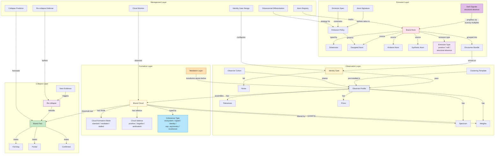
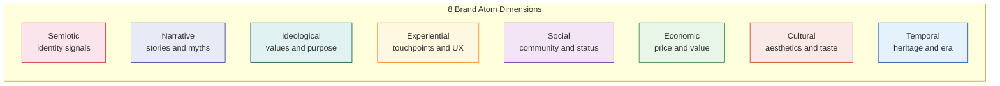
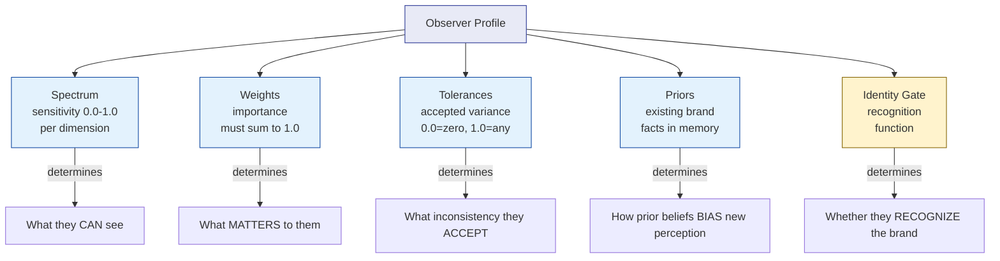
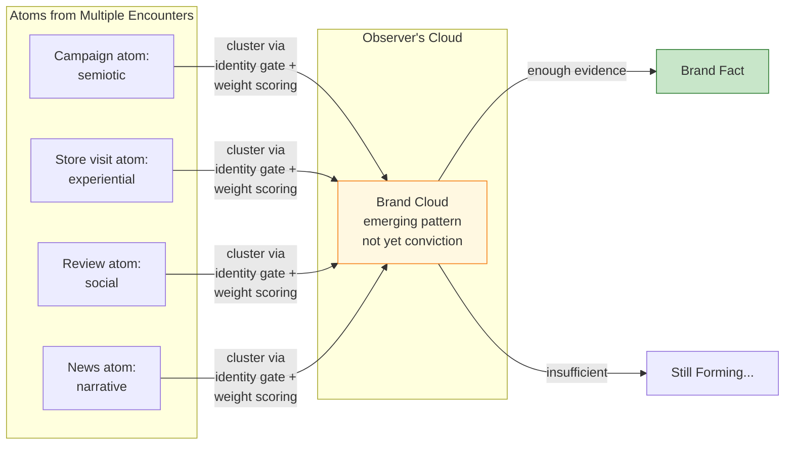
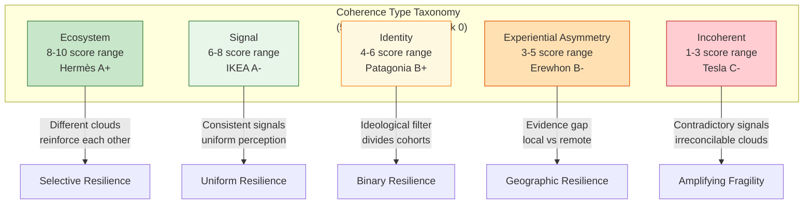
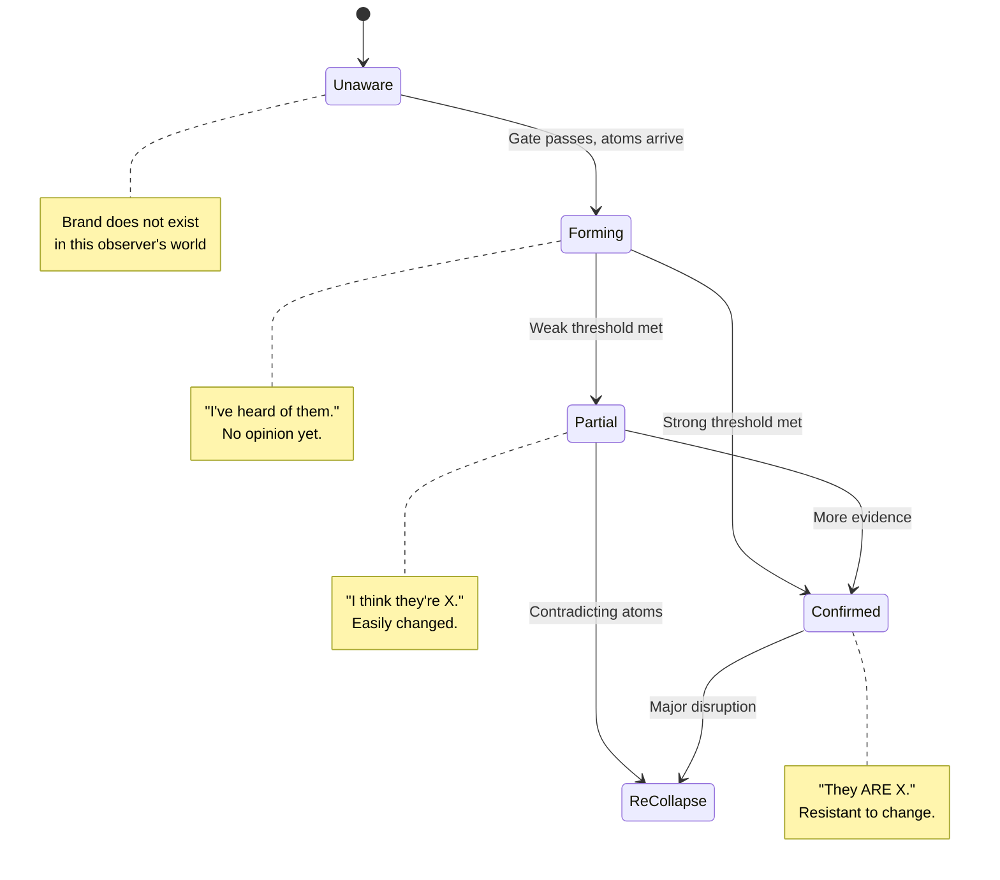

# Spectral Brand Theory: Glossary

**Version**: 2.0 (Post-Track-0 Validation)
**Status**: Draft
**Last Updated**: 2026-02-27
**Related**: `SPECTRAL_BRANDING_FRAMEWORK.md`, `BOOK_STRUCTURE_PROPOSAL.md`

### v2.0 Additions (Track 0 Discoveries)
- **Dark Signals / Structural Absence**: value creation through designed signal restriction
- **Emission Type Taxonomy**: positive, null, structural absence
- **Coherence Type Taxonomy**: ecosystem, signal, identity, experiential asymmetry, incoherent
- **Temporal Mode**: heritage vs currency
- **Cloud Formation Mode**: standard, mediated, stalled
- **Cloud Valence**: positive, negative, ambivalent
- **Weight-Barrier-Crossing Signal**: signals that bypass dimensional filtering
- **Scarcity Multiplier**: amplification of positive signals by structural absence

### v2.1 Additions (Non-Ergodic Perception)
- **Non-Ergodic Perception**: brand perception as a multiplicative, path-dependent process
- **Ergodicity Coefficient**: per-dimension measure of ensemble metric reliability
- **Absorbing State**: irreversible negative conviction basin

---

## Overview

Comprehensive glossary of Spectral Brand Theory (SBT) terminology. Terms are organized by conceptual layer (emission, observation, formation, collapse, management) with cross-references and relationship diagrams.

---

## Term Relationship Map

---

## Emission Layer

### Brand Atom

The irreducible unit of brand meaning. A discrete signal emitted by or about a brand, typed by one of 8 dimensions. Analogous to an atom in the alibi project (a typed observation extracted from a document).

- **Properties**: dimension (type), source (designed/ambient/synthetic), channel, timestamp, content
- **Key principle**: atoms are source-bound -- each originates from one encounter or event
- **See also**: Dimension, Designed Atom, Ambient Atom, Encounter Bundle

### Dimension

One of 8 typed channels through which brand atoms are classified. Each dimension captures a distinct facet of brand meaning.

| Dimension | What It Captures | Examples |
|-----------|-----------------|----------|
| **Semiotic** | Visual and auditory identity signals | Logo, name, colors, sounds, typography, packaging |
| **Narrative** | Stories, myths, temporal structures | Origin story, founder myth, key events, future vision |
| **Ideological** | Values, ethics, purpose, positions | Stated values, ethical stances, promises, transparency |
| **Experiential** | Touchpoints, interactions, product encounters | Product use, service quality, digital UX, failure recovery |
| **Social** | Community, status, belonging signals | Tribe markers, status signals, peer endorsement, rituals |
| **Economic** | Price, value, financial signals | Price point, value proposition, premium signal, discounts |
| **Cultural** | Aesthetic codes, references, taste | Design sensibility, cultural allusions, humor, zeitgeist |
| **Temporal** | Heritage, evolution, era associations | Brand age, nostalgia, trend position, longevity signal |

### Designed Atom

A brand atom intentionally created and emitted by the brand. The brand has direct control over these atoms.

- **Examples**: advertising campaigns, product design, packaging, official communications, store design
- **Contrast with**: Ambient Atom, Synthetic Atom
- **Key insight**: brands control only a fraction of their total atom output

### Ambient Atom

A brand atom generated by the environment, not by the brand itself. The brand has no direct control over these atoms but must manage their effects.

- **Examples**: customer reviews, news coverage, competitor framing, cultural shifts, word-of-mouth
- **Key insight**: the tension between designed and ambient atoms is where brand management actually happens

### Synthetic Atom

A brand atom generated by AI systems. May be designed (brand uses AI for content) or ambient (AI-generated reviews, deepfakes, LLM summaries about the brand).

- **Examples**: AI-generated ads, synthetic reviews, LLM brand evaluations, deepfake endorsements
- **Key insight**: synthetic atoms create the "forgery problem" -- brand facts assembled from signals no human created
- **See also**: Mediation Layer

### Encounter Bundle

A coherent group of brand atoms from a single encounter or channel. Analogous to a bundle in alibi (a group of atoms from one document).

| Bundle Type | Channel | Typical Dimensions |
|-------------|---------|-------------------|
| CAMPAIGN | Advertising, sponsored content | semiotic, narrative, cultural, economic |
| ENCOUNTER | Store/service visit | experiential, semiotic, social, economic |
| USAGE | Product consumption, service use | experiential, economic, temporal |
| TESTIMONY | Word-of-mouth, reviews | narrative, social, ideological |
| EMPLOYMENT | Working at the brand | cultural, ideological, social, economic |
| INVESTMENT | Financial relationship | economic, narrative, temporal |
| NEWS | Media coverage, journalism | narrative, cultural, social, ideological |

### Emission Policy

The set of rules governing which brand atoms the brand intentionally generates and which dimensions it prioritizes. Replaces the traditional concept of "brand ideology" in SBT.

- **Traditional equivalent**: brand ideology, brand values, brand purpose
- **Key difference**: emission policy is operational (what to emit), not philosophical (what to believe)

### Atom Signature

The consistent dimensional ratio in a brand's communications. Defines the relative proportions of atom types the brand emits. Replaces "tone of voice" in SBT.

- **Example**: "40% ideological + 30% cultural + 20% social + 10% semiotic" for a purpose-driven brand
- **Key principle**: signature consistency is what makes atoms cluster predictably across encounters

### Emission Spec

The operational document constraining atom emission to ensure atoms pass the identity gate and cluster predictably. Replaces "brand book / brand guidelines" in SBT.

### Emission Type (v2.0)

Classification of how a brand atom relates to signal presence or absence. Three types:

| Type | Mechanism | Example | Physics Analog |
|------|-----------|---------|---------------|
| **Positive** | Signal present, atoms accumulate | Campaign, product launch, social post | Normal matter (visible) |
| **Null** | Signal absent, unintentional | Brand goes silent, forgotten, dormant dimension | Vacuum (zero mass) |
| **Structural Absence** | Designed scarcity as signal | Empty shelf, wait list, no discounts, geographic restriction | Dark matter (invisible but gravitationally active) |

- **Key insight**: null emission and structural absence look identical from the outside (both are "nothing happening"). The difference is INTENT: null is negligence, structural absence is strategy.
- **See also**: Dark Signals, Scarcity Multiplier

### Dark Signals (v2.0)

The accessible name for the **structural absence** mechanism: designed signal restriction that creates value through what is NOT there. Like dark matter in physics -- invisible but gravitationally active, shaping the perception field without being directly observable.

- **Formal name**: structural absence
- **Discovered**: Track 0, Hermès case study (A+)
- **Confirmed**: Track 0, Erewhon case study (B-) at $20 price point
- **Dimensional specificity**: operates primarily on social (exclusivity), economic (no discounts), experiential (geographic scarcity). CANNOT operate on semiotic (no "absent logo") or narrative (absence of story is just absence).
- **Scale-independent**: works identically at $20 (Erewhon smoothie) and $15,000 (Hermès handbag)
- **Key examples**: Hermès wait lists, no online Birkin sales, never discounting, limited stores (~300 worldwide). The empty shelf IS the signal.
- **Formula**: Cloud = Σ(emitted_atoms × weights) + Σ(absent_atoms × scarcity_multiplier × weights)
- **See also**: Structural Absence, Scarcity Multiplier, Emission Type

### Structural Absence (v2.0)

The formal name for the **dark signals** mechanism. Designed scarcity that functions as a brand signal, creating a gravitational well that amplifies the perceived weight of existing positive atoms.

- **Not antimatter**: structural absence does NOT cancel positive signals. It AMPLIFIES them through contrast. The physics analog is dark matter (invisible, structurally essential), not antimatter (opposite charge, annihilates).
- **Properties**: (1) cannot be observed directly, (2) detected through effects on visible signals, (3) comprises a significant portion of brand power in scarcity brands, (4) invisible but structurally essential
- **See also**: Dark Signals, Scarcity Multiplier

### Scarcity Multiplier (v2.0)

The amplification factor that structural absence applies to positive signals on affected dimensions. When a brand restricts access (economic, experiential, social), existing positive signals on those dimensions are perceived as more valuable.

- **Formula**: amplified_weight = base_weight × scarcity_multiplier
- **Levels**: low (1.1-1.3x), medium (1.3-1.7x), high (1.7-2.5x+)
- **Example**: Hermès' refusal to discount (economic structural absence) amplifies the economic signal of each product sold. The price becomes proof of value because it never drops.
- **See also**: Dark Signals, Structural Absence

### Temporal Mode (v2.0)

The brand's relationship with the temporal dimension. Two primary modes with opposite risk profiles:

| Mode | Mechanism | Risk | Example |
|------|-----------|------|---------|
| **Heritage** | Draws value from accumulated history | Irrelevance (losing contemporary connection) | Hermès (187 years, foundational) |
| **Currency** | Draws value from present-moment cultural relevance | Expiration (losing relevance when trend passes) | Erewhon (~10 years, culturally current) |
| **Dormant** | Temporal dimension inactive/under-leveraged | Missed defensive asset | Tesla (20+ years, ignored) |

- **Discovered**: Track 0, Erewhon vs Hermès comparison
- **Heritage compounding curve**: non-linear. 20yr = supplementary → 50yr = moderate → 80yr = approaching threshold → 180yr+ = foundational architecture
- **Key insight**: heritage is the ONLY dimension competitors cannot replicate and no disruption can erase

---

## Observation Layer

### Observer Profile

The formal model of an observer's perceptual apparatus. Defines HOW a specific observer (or cohort) assembles brand atoms into meaning.

- **Five components**: spectrum, weights, tolerances, priors, identity gate
- **Key principle**: different observers with different profiles assemble different brand facts from identical atoms
- **See also**: Observer Cohort, Spectrum, Weights, Tolerances, Priors

### Spectrum

The observer's sensitivity to each of the 8 brand atom dimensions. Ranges from 0.0 (invisible -- cannot perceive this dimension) to 1.0 (full sensitivity). Determines WHAT the observer can see.

- **Example**: a Gen-Z consumer has high sensitivity to social (0.9) and cultural (0.8) atoms, low sensitivity to temporal (0.2)
- **Analogy**: like different species seeing different wavelengths of light. Some animals see infrared, others see ultraviolet, none see all

### Weights

The importance the observer assigns to each dimension, governing how atoms influence cloud formation. Must sum to 1.0. Determines what MATTERS to the observer.

- **Distinction from spectrum**: spectrum = can you see it; weights = does it matter to you. You might see economic atoms (spectrum: 0.7) but not care about them (weight: 0.05)

### Tolerances

The amount of variance or inconsistency the observer accepts before atoms fail to cluster or trigger re-collapse. Ranges from 0.0 (zero tolerance) to 1.0 (anything goes).

- **Example**: brand employees have zero tolerance (0.0) for ideological inconsistency between the brand's stated values and its workplace practices

### Priors

Existing brand facts already collapsed in the observer's memory. Priors bias how new atoms are perceived and clustered.

- **Key dynamic**: strong priors (confirmed facts) resist contradicting atoms. Weak priors (partial facts) are easily reshaped.
- **Analogy**: confirmation bias -- existing beliefs shape how new evidence is interpreted

### Identity Gate

The precondition for all brand perception: can the observer recognize these atoms as belonging to a specific brand? Analogous to the vendor gate in alibi (the hard constraint that two bundles must match on vendor identity to cluster).

- **What passes the gate**: logo, brand name, distinctive visual identity, sonic identity
- **What happens on failure**: atoms are perceived as noise, not attributed to any brand, no cloud forms
- **Key insight**: brand awareness = gate permeability. Byron Sharp's "mental availability" = how many observers' gates this brand can pass

### Observer Cohort

A group of observers who share similar profiles (spectrum, weights, tolerances). The same brand produces similar clouds within a cohort but different clouds across cohorts.

- **Examples**: Gen-Z consumers, B2B procurement buyers, brand employees, investors, cultural critics
- **Key principle**: cohorts are not fixed demographics -- a person can shift between cohort profiles contextually (consumer on Saturday, investor on Monday)

### Clustering Template

A pre-compiled set of instructions, installed by culture, that tells observers how to assemble brand atoms into recognizable patterns. Replaces "archetypes" in SBT.

- **Traditional equivalent**: Jungian archetypes (Hero, Explorer, Sage, etc.)
- **Key reframe**: archetypes are NOT brand properties -- they are observer functions. "The Hero" is not what the brand IS; it's a set of scoring rules pre-installed in observers that says "weight narrative atoms high, look for conflict-resolution patterns, expect ideological atoms about courage"
- **See also**: Observer Profile

### Mediation Layer

The AI algorithms and platform systems that filter, re-rank, and re-contextualize brand atoms before they reach human observers. A pipeline stage unique to the AI era.

- **Examples**: social media recommendation algorithms, search engine ranking, e-commerce product placement, content curation AI
- **Key insight**: the brand emits atom X, but the mediation layer presents atom X' to the observer. The brand increasingly does not control what observers actually perceive

---

## Formation Layer

### Brand Cloud

A probabilistic cluster of brand atoms forming in an observer's perception. The proto-brand-image -- a hypothesis about what the brand is, before conviction forms. Analogous to a cloud in alibi (a cluster of bundles that might represent the same transaction).

- **Key principle**: clouds are observer-specific. The same atoms produce different clouds in different observers because of different weight profiles
- **Cloud coherence**: when target cohorts form similar clouds = healthy brand. When they form divergent clouds = brand scatter

### Cloud Divergence

When different observer cohorts form radically different brand clouds from the same atoms. Signals a coherence problem -- the brand means different things to different audiences in ways the brand did not intend.

- **Controlled divergence**: acceptable when intended (luxury brand means "aspiration" to consumers, "margin" to investors)
- **Uncontrolled divergence**: problematic when unintended (brand means "innovation" to customers but "exploitation" to employees)

### Cloud Formation Mode (v2.0)

How a brand cloud forms in an observer's perception. Three modes with different stability properties:

| Mode | Mechanism | Stability | Example |
|------|-----------|-----------|---------|
| **Standard** | Direct product/brand encounter | Highest — evidence-based | Hermès Heritage Client visiting store |
| **Mediated** | Screen-based, no direct encounter | Medium — dual-coded (aspirational + incomplete) | Erewhon Digital Observer on TikTok |
| **Stalled** | Contradictory signals prevent development | Low — permanently forming | Tesla's Boycotter political cloud |

- **Discovered**: Track 0, Erewhon case study (Digital Observer's 0.45 cloud = permanently mediated)
- **Key insight**: mediated clouds may NEVER collapse to conviction. They exist in a permanent pre-conviction state — the observer has an impression but never a conviction. This is increasingly the default for digital-native brand perception.
- **See also**: Brand Cloud, Cloud Valence

### Cloud Valence (v2.0)

Whether a brand cloud is positive, negative, or ambivalent in its overall character. Valence affects resilience dynamics:

| Valence | Character | Resilience Pattern |
|---------|-----------|-------------------|
| **Positive** | Observer perceives brand favorably | Weakens under negative disruption |
| **Negative** | Observer perceives brand unfavorably | STRENGTHENS under negative disruption |
| **Ambivalent** | Mixed positive/negative perception | Unstable — could tip either way |

- **Discovered**: Track 0, Tesla case study (Boycotter's negative cloud strengthens during brand crises)
- **Key insight**: evidence-free negative convictions are MORE stable than evidence-rich positive ones. The Boycotter (0.82 confidence) has zero product experience — no experiential data to create cognitive dissonance. The Tech Loyalist (0.85 confidence) has real product data that creates nuance and vulnerability.
- **See also**: Cloud Formation Mode, Re-collapse Resistance

### Non-Ergodic Perception (v2.1)

The property that brand perception is a multiplicative, path-dependent process in which ensemble averages (measuring the "average observer" across a population at one moment) diverge from time averages (tracking one observer's perception over time). Derived from Peters' (2019) ergodicity economics (*Nature Physics*).

- **Core insight**: when signals compound rather than add, sequence matters and ruin (negative conviction) is an absorbing state. What happens to the "average observer" does not predict what happens to any individual cohort over time.
- **Brand application**: brand power (ensemble measure — aggregate awareness) and brand health (time-average measure — architectural resilience for any given cohort) are independent variables precisely because brand perception is non-ergodic.
- **Measurement implication**: for non-ergodic brands (low coherence, low D/A ratio), aggregate metrics like NPS and awareness tracking are structurally misleading — they average trajectories that are diverging. Longitudinal cohort-trajectory tracking is required instead.
- **Reference**: Peters, O. (2019). The ergodicity problem in economics. *Nature Physics*, 15, 1216–1221.
- **See also**: Ergodicity Coefficient, Absorbing State, Brand Power vs Brand Health

### Ergodicity Coefficient (v2.1)

A diagnostic measure (epsilon) per brand-dimension or brand-cohort pair, ranging from 0.0 to 1.0, indicating the degree to which ensemble metrics reliably predict individual cohort trajectories for that dimension.

- **epsilon = 1.0**: perfectly ergodic — cross-sectional surveys reliably predict any cohort's trajectory. Safe to use aggregate metrics.
- **epsilon -> 0.0**: strongly non-ergodic — ensemble average is meaningless for this dimension. Must track individual cohort trajectories longitudinally.
- **Diagnostic question**: "Does the average observer's perception of [dimension] predict any specific observer's perception trajectory over time?"
- **Example (Tesla)**: semiotic epsilon = 0.8 (logo stable across cohorts/time), ideological epsilon = 0.1 (pro-Musk and anti-Musk on divergent trajectories — average is a fiction)
- **Practical use**: determines whether a dimension can be safely measured with surveys (high epsilon) or requires cohort-trajectory tracking (low epsilon)
- **See also**: Non-Ergodic Perception, Coherence Type

### Absorbing State (v2.1)

In non-ergodic brand perception, a conviction state from which no future signals can extract the observer. Once an observer's negative conviction crosses a threshold with no experiential data to create friction, it enters an absorbing basin — each subsequent negative signal compounds it further, and positive signals cannot reach the observer because their spectral profile excludes the relevant dimensions.

- **Discovered**: Track 0, Tesla case study (Progressive Boycotter: 0.82 confidence, 0.03 experiential weight — experiential gate effectively closed)
- **Mechanism**: the observer's conviction is built on dimensions (ideological, social) that only receive confirming signals. The dimension that could create dissonance (experiential) is weighted at near-zero. The conviction self-reinforces without bound.
- **Physics analog**: absorbing state in non-ergodic multiplicative processes (Peters, 2019) — once wealth hits zero, no future gains recover it. Once negative conviction crosses threshold, no future positive signals reach the observer.
- **Strategic implication**: resources spent converting observers in absorbing states are wasted. The experiential gate is closed. The conviction is structurally irrecoverable.
- **See also**: Non-Ergodic Perception, Cloud Valence, Re-collapse Resistance

### Coherence Type (v2.0)

Qualitative classification of how a brand's clouds relate across observer cohorts. Track 0 discovered that coherence has TYPES, not just levels — a 7/10 Signal Coherence and a 7/10 Ecosystem Coherence have fundamentally different structural properties.

| Type | Mechanism | Resilience | Discovered In |
|------|-----------|------------|---------------|
| **Ecosystem** | Different clouds reinforce through functional interdependence | Selective — absorbs disruption by purification | Hermès (A+) |
| **Signal** | Consistent designed signals produce consistent clouds | Uniform — transmits disruption evenly | IKEA (A-) |
| **Identity** | Strong ideological core filters cohort compatibility | Binary — divides along ideological line | Patagonia (B+) |
| **Experiential Asymmetry** | Extreme experiential variance (local access vs remote) | Geographic — local/remote affected differently | Erewhon (B-) |
| **Incoherent** | Strong contradictory signals produce irreconcilable clouds | Amplifying — disruption widens existing cracks | Tesla (C-) |

- **Most important theoretical contribution of Track 0**
- **Key insight**: traditional brand analysis treats coherence as "how consistent is the brand?" — a single dimension. The spectral model reveals coherence has qualitative types with structurally different resilience properties.
- **See also**: Cloud Coherence, Cloud Divergence

### Weight-Barrier-Crossing Signal (v2.0)

A signal that bypasses an observer's dimensional weight filtering to activate a response on a dimension they normally ignore. Certain signals (child exploitation, safety threats, environmental catastrophe) have universal activation thresholds that override individual spectral profiles.

- **Discovered**: Track 0, IKEA case study (child labor scandal activates Budget Family via experiential/safety dimension, despite 0.05 ideological weight)
- **Mechanism**: the signal migrates from its primary dimension to another dimension where the observer IS sensitive. Ideological issue → experiential/safety concern → bypasses ideological weight barrier.
- **Key insight**: not all dimensional weights are absolute. Some signals have priority channels that override the spectral profile.

### Atom Scatter

When brand atoms fail to cluster at all -- they arrive at the observer but don't form a coherent cloud. Caused by inconsistent emission (atoms across encounters contradict each other) or weak identity gate (observer can't recognize them as the same brand).

- **Symptom**: brand awareness exists (gate passes) but no clear brand image forms
- **Cause**: emission policy lacks a consistent atom signature

---

## Collapse Layer

### Brand Fact

A collapsed conviction about what the brand IS in a specific observer's mind. The end product of the spectral pipeline. Analogous to a fact in alibi (a confirmed financial transaction).

- **Critical distinction**: brand facts are ALWAYS observer-specific. There is no universal brand fact. "The brand" as a singular entity is a convenient fiction.
- **Properties**: content (what the observer believes), confidence (how strongly), stability (how resistant to re-collapse)

### Collapse States

| State | Description | Stability | Equivalent |
|-------|-------------|-----------|------------|
| **Unaware** | Brand does not exist in this observer's world | N/A | Zero awareness |
| **Forming** | Atoms arriving and clustering, no conviction yet | Very low | Aided awareness, no opinion |
| **Partial** | Provisional opinion formed, subject to change | Low-Medium | Weak brand image |
| **Confirmed** | Strong conviction, resistant to contradicting atoms | High | Strong brand equity |

### Re-collapse

When new evidence (atoms) forces an observer to rebuild their brand fact from scratch. The existing fact is discarded and the full evidence set is re-evaluated. Analogous to re-collapse in alibi (when a new bundle joins an already-collapsed cloud, the fact is deleted and re-collapsed with all evidence).

- **Triggers**: scandal, rebrand, product failure, viral moment, brilliant campaign, competitor reframing
- **Key principle**: facts are rebuilt, never patched. This explains why some brands recover from scandals (new positive atoms outweigh negative in re-collapse) and some don't
- **See also**: Re-collapse Resistance, Re-collapse Defense

### Re-collapse Resistance

The degree to which a confirmed brand fact resists re-collapse when contradicting atoms arrive. High resistance = strong brand equity.

- **Factors**: confirmation bias (priors protect existing facts), volume of corroborating atoms, emotional investment
- **Hysteresis hypothesis**: confirmed facts may require more evidence to overturn than partial facts required to form (unvalidated)

### Single-Bundle Collapse

When one encounter alone is sufficient to form a brand fact, without corroboration from other encounters. Analogous to single-bundle collapse in alibi (a standalone receipt becomes a fact directly).

- **Example**: one devastating news article about a brand scandal creates a brand fact with no other encounters needed
- **Key insight**: for observers with no priors, a single powerful encounter defines the brand entirely

---

## Management Layer

### Atom Registry

A system for tracking every brand atom -- both designed (intentional emissions) and ambient (environmental signals). The foundation of data-driven spectral brand management.

- **Alibi analog**: atom storage (documents -> atoms)
- **Tracks**: atom type (dimension), source, channel, timestamp, reach, observer cohort exposure

### Cloud Monitor

Real-time tracking of which atoms are clustering in which observer cohorts. Reframes traditional "social listening" and "brand tracking" as cloud formation measurement.

- **Key metrics**: cloud coherence, cloud divergence, atom scatter rate
- **Alibi analog**: cloud formation (probabilistic clustering)

### Collapse Predictor

An AI model that predicts: "Given current cloud state in cohort X, adding atom set Y will trigger collapse into fact Z with probability P." No alibi analog -- this is an AI-native capability unique to SBT.

- **Value**: enables simulation before execution ("if we launch this campaign, how will it change the brand fact for each cohort?")

### Re-collapse Defense

Monitoring for incoming atoms that could force unwanted re-collapse, and pre-positioning counter-atoms to buffer against it. Reframes traditional "crisis management" in SBT.

- **Alibi analog**: re-collapse on new evidence
- **Key principle**: speed matters -- in the AI era, re-collapse happens in hours, not months

### Dimensional Differentiation

Choosing which atom dimensions to dominate so that brand clouds are structurally distinct from competitors' clouds in observers' perceptual space. Replaces "positioning" in SBT.

- **Traditional equivalent**: brand positioning, competitive differentiation
- **Key difference**: positioning is about where you sit in a market map. Dimensional differentiation is about which spectral frequencies you dominate

### Identity Gate Design

Configuring how multiple brands share or separate their identity gates. Replaces "brand architecture" in SBT.

| Architecture | Gate Design | Example |
|-------------|-------------|---------|
| Branded House | Single gate for all | Google (Search, Maps, Drive all share one gate) |
| House of Brands | Separate gates | P&G (Tide, Pampers, Gillette have independent gates) |
| Endorsed | Partial gate sharing | Marriott (Courtyard by Marriott shares partial gate) |

### Forced Re-collapse

Intentionally disrupting existing brand facts by changing the identity gate (new semiotic atoms) and flooding the system with new atoms across all dimensions. Replaces "rebranding" in SBT.

- **Risk**: if the re-collapse doesn't converge on the intended new fact, the brand enters a Forming state with no conviction -- worse than before

---

## Metrics

### Core Metrics (v1.0)

| Metric | What It Measures | Traditional Equivalent |
|--------|-----------------|----------------------|
| **Atom Coverage** | How many of 8 dimensions the brand actively emits on | Brand presence breadth |
| **Gate Permeability** | % of target observers who can recognize the brand | Brand awareness |
| **Cloud Coherence** | Similarity of clouds across target cohorts | Brand consistency |
| **Cloud Divergence** | Difference in clouds across cohorts (controlled vs uncontrolled) | Perception gap analysis |
| **Atom Scatter** | Rate of atoms failing to cluster | Brand confusion |
| **Collapse Strength** | Confidence level of collapsed brand facts | Brand equity / NPS |
| **Re-collapse Resistance** | Stability of facts under contradicting atoms | Brand resilience |
| **Emission Efficiency** | Ratio of designed atoms that successfully cluster vs scatter | Campaign effectiveness |

### Track 0 Metrics (v2.0)

| Metric | What It Measures | Discovered In |
|--------|-----------------|---------------|
| **Coherence Type** | Qualitative type of brand coherence (ecosystem/signal/identity/experiential_asymmetry/incoherent) | Cross-study (all 5 brands) |
| **D/A Ratio** | Designed vs ambient signal balance; Goldilocks zone = 55-65% designed | IKEA, cross-study |
| **Cloud Valence** | Whether cloud is positive/negative/ambivalent; negative clouds strengthen under disruption | Tesla (Boycotter) |
| **Cloud Formation Mode** | How cloud formed (standard/mediated/stalled); mediated may never collapse | Erewhon (Digital Observer) |
| **Temporal Mode** | Heritage vs currency relationship with time; heritage compounds non-linearly | Erewhon vs Hermès |
| **Structural Absence Index** | Degree to which dark signals contribute to brand value; scarcity multiplier effect | Hermès, Erewhon |
| **Cohort Interdependence** | How much one cohort's cloud depends on another cohort's behavior | Hermès (ecosystem) |

### Non-Ergodic Perception Metrics (v2.1)

| Metric | What It Measures | Discovered In |
|--------|-----------------|---------------|
| **Ergodicity Coefficient** | Per-dimension reliability of ensemble metrics for predicting cohort trajectories (0.0 = non-ergodic, 1.0 = ergodic) | Cross-study (Peters 2019 + SBT synthesis) |
| **Absorbing State Detection** | Whether a cohort's negative conviction has crossed the irrecoverable threshold | Tesla (Progressive Boycotter) |

---

## Traditional Concept Mapping

Quick reference for translating between traditional branding vocabulary and SBT.

| Traditional Term | SBT Term | Key Difference |
|-----------------|----------|----------------|
| Brand identity | Emission policy + atom signature | Not what the brand IS but what it EMITS |
| Brand image | Brand fact (observer-specific) | Not singular -- different per observer cohort |
| Brand equity | Aggregate collapse strength | Measured as collapse confidence across cohorts |
| Brand awareness | Gate permeability | Precondition for all perception, not a separate metric |
| Positioning | Dimensional differentiation | Not where you sit but which frequencies you dominate |
| Brand architecture | Identity gate design | How gates are shared or separated across sub-brands |
| Tone of voice | Atom signature | Consistent dimensional ratios, not just verbal style |
| Brand guidelines | Emission spec | Operational constraints on atom generation |
| Rebranding | Forced re-collapse | Intentional destruction and rebuilding of brand facts |
| Crisis management | Re-collapse defense | Buffering against unwanted fact rebuilding |
| Brand tracking | Cloud monitoring | Measuring what clusters, not just what people "think" |
| Archetypes | Clustering templates | Not brand properties but observer scoring functions |
| Target audience | Observer cohort | Defined by perceptual apparatus, not demographics |

---

## References

**Framework**: `SPECTRAL_BRANDING_FRAMEWORK.md`
**Taxonomy**: `data/ATOM_TAXONOMY.yaml`
**Related work**: `research/RELATED_WORK.md`
