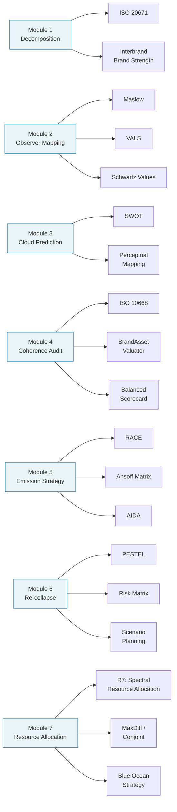

# Frameworks and Standards Reference

Which external frameworks and standards each SBT module uses, why, and what alternatives are available.

---

## Design Principle

SBT modules reference established frameworks to:
1. **Anchor** outputs in recognized methodology (practitioners trust familiar structures)
2. **Structure** thinking without reinventing categorization schemes
3. **Bridge** SBT analysis into existing organizational processes

Frameworks are **optional scaffolding**, not requirements. Each template documents which framework it uses and lists alternatives. Users should swap frameworks to match their organization's existing tools.

---

## Module-Framework Map

---

## Module 1: Brand Decomposition

### Primary: ISO 20671:2021 (Brand Evaluation)

**What it does**: Provides principles for evaluating brand strength across multiple dimensions. SBT uses it to validate that the 8-dimension model covers the key evaluation areas.

**How SBT uses it**: The dimension heat map and emission signature map to ISO 20671's multi-dimensional evaluation approach. ISO's "Relevance", "Differentiation", and "Credibility" dimensions cross-cut SBT's 8 dimensions.

**Mapping**:
| ISO 20671 Dimension | SBT Dimension(s) |
|---------------------|-------------------|
| Relevance | Experiential, Economic, Social |
| Differentiation | Semiotic, Cultural, Narrative |
| Credibility | Ideological, Temporal |
| Consistency | (Cross-cutting — measured in Module 4) |

### Secondary: Interbrand Brand Strength Model

**What it does**: Scores brands on 10 factors (clarity, commitment, governance, responsiveness, authenticity, relevance, consistency, differentiation, presence, engagement).

**How SBT uses it**: Interbrand's factors map to SBT dimensions and metrics. Useful for organizations already using Interbrand methodology.

### Alternatives

| Framework | When to Use | Trade-off |
|-----------|-------------|-----------|
| **Kapferer's Brand Identity Prism** | European tradition; 6 facets (physique, personality, culture, relationship, reflection, self-image) | Fewer dimensions than SBT, more brand-side focus |
| **Keller's CBBE Model** | When building equity pyramid (salience → performance/imagery → judgments/feelings → resonance) | Stage-based rather than dimensional |
| **De Chernatony's Brand Box** | When the brand-organization relationship is central | Adds internal brand culture dimension |

---

## Module 2: Observer Mapping

### Primary: Maslow's Hierarchy of Needs

**What it does**: Classifies human needs into 5 levels (physiological → safety → belonging → esteem → self-actualization). Extended model adds self-transcendence.

**How SBT uses it**: Maslow levels help derive dimension weights for observer cohorts. A cohort operating at "esteem" level will weight Social and Cultural dimensions higher. A "self-transcendence" cohort will weight Ideological higher.

**Weight derivation heuristic**:
| Maslow Level | High-Weight Dimensions |
|--------------|----------------------|
| Safety | Economic, Experiential |
| Belonging | Social, Cultural |
| Esteem | Social, Semiotic, Economic |
| Self-actualization | Experiential, Narrative |
| Self-transcendence | Ideological, Narrative |

### Secondary: VALS Psychographic Segments

**What it does**: Classifies consumers by primary motivation (ideals, achievement, self-expression) and resources (high/low).

**How SBT uses it**: VALS segments map to cohort archetypes with pre-calibrated spectral profiles. "Innovators" (high resources, all motivations) have broad spectrums. "Believers" (ideals, low resources) have narrow, ideologically-weighted spectrums.

### Secondary: Schwartz Theory of Basic Human Values

**What it does**: Maps 10 universal value types on two axes (openness-to-change vs conservation, self-enhancement vs self-transcendence).

**How SBT uses it**: Schwartz values calibrate observer tolerances. "Conservation" values → low consistency tolerance. "Openness to change" → higher consistency tolerance. "Self-transcendence" → low authenticity tolerance.

### Alternatives

| Framework | When to Use | Trade-off |
|-----------|-------------|-----------|
| **Jobs-to-be-Done (Christensen)** | When analyzing functional/utility-driven brands | Functional focus; weaker for identity-driven brands |
| **Personas (Cooper)** | When demographic detail matters more than psychographic profile | Rich detail per persona, but doesn't formalize spectral properties |
| **Sinus-Milieus** | German/European market segmentation with social class overlay | Geographically specific, strong in DACH markets |
| **Rokeach Value Survey** | When individual values (not segments) drive the analysis | Granular but harder to operationalize into cohorts |
| **Hofstede Cultural Dimensions** | When analyzing cross-cultural observer differences | National culture level, not individual psychographic |

---

## Module 3: Cloud Prediction

### Primary: SWOT Analysis

**What it does**: Categorizes factors into Strengths, Weaknesses, Opportunities, Threats.

**How SBT uses it**: SWOT maps to cloud dynamics — strengths are strong signal clusters, weaknesses are gaps or scatter, opportunities are activatable dormant dimensions, threats are ambient signals that could destabilize the cloud.

**SBT-SWOT mapping**:
| SWOT Quadrant | Cloud Dynamic |
|---------------|--------------|
| Strengths | Strong, consistent signal clusters in high-weight dimensions |
| Weaknesses | Gaps, scatter, or contradictions in the cloud |
| Opportunities | Dormant dimensions that could strengthen the cloud if activated |
| Threats | Ambient signals or competitor moves that could destabilize clusters |

### Secondary: Perceptual Mapping

**What it does**: Plots brands on a 2D space defined by key attributes (e.g., premium vs affordable, traditional vs innovative).

**How SBT uses it**: SBT extends perceptual mapping from 2D to 8D. Each dimension becomes an axis. Clouds can be compared across brands in multi-dimensional space.

### Alternatives

| Framework | When to Use | Trade-off |
|-----------|-------------|-----------|
| **Force Field Analysis (Lewin)** | When focusing on driving forces vs restraining forces in cloud formation | Good for change dynamics, but binary (for/against) |
| **Stakeholder Mapping (Mendelow)** | When cohort influence/power matters as much as perception | Adds power dimension SBT doesn't model |
| **Blue Ocean Strategy Canvas** | When comparing spectral signatures across competitors | Good for competitive differentiation, less for perception modeling |
| **Porter's Five Forces** | When market structure influences perception dynamics | Industry-level, not brand-level |

---

## Module 4: Coherence Audit

### Primary: ISO 10668:2010 (Brand Valuation)

**What it does**: International standard for monetary brand valuation. Requires analysis of legal, behavioral, and financial dimensions.

**How SBT uses it**: ISO 10668's behavioral analysis requirements map to SBT's 7 metrics. Organizations performing ISO-compliant brand valuations can use SBT audit output as input to the behavioral dimension.

### Secondary: BrandAsset Valuator (BAV)

**What it does**: Measures brands on 4 pillars — Differentiation, Relevance, Esteem, Knowledge.

**How SBT uses it**: BAV pillars map to specific SBT metrics:
| BAV Pillar | SBT Metric(s) |
|------------|---------------|
| Differentiation | Dimensional Coverage, Emission Efficiency |
| Relevance | Collapse Strength, Cloud Coherence |
| Esteem | Collapse Strength, Re-collapse Resistance |
| Knowledge | Gate Permeability |

### Secondary: Balanced Scorecard (Kaplan/Norton)

**What it does**: Structures performance measurement across 4 perspectives (financial, customer, internal, learning).

**How SBT uses it**: BSC's multi-perspective approach informs the SBT scorecard structure. Each SBT metric is scored with numeric value + qualitative evidence, similar to BSC's balanced measurement philosophy.

### Alternatives

| Framework | When to Use | Trade-off |
|-----------|-------------|-----------|
| **Net Promoter Score (NPS)** | When a single loyalty metric is needed | Maps roughly to SBT collapse strength. Too simple for full audit |
| **Keller's CBBE Pyramid** | When audience expects equity-pyramid framing | Identity → Meaning → Response → Resonance maps to Gate → Cloud → Collapse |
| **Aaker's Brand Equity Model** | When focusing on awareness/associations/quality/loyalty | Each Aaker component maps to one SBT metric |
| **Brand Health Index (BHI)** | When integrating with corporate dashboards | Proprietary variants; SBT audit can feed BHI inputs |
| **Brand Keys Customer Loyalty Index** | When loyalty prediction is the primary goal | Narrower than SBT audit but deeper on loyalty dimension |

---

## Module 5: Emission Strategy

### Primary: RACE (Reach / Act / Convert / Engage)

**What it does**: Structures digital marketing planning into 4 stages — building awareness, driving interaction, converting to action, building loyalty.

**How SBT uses it**: Each signal-creation action in the emission plan is tagged with its RACE stage. This helps practitioners map SBT actions into existing marketing plans.

**SBT-RACE mapping**:
| RACE Stage | SBT Activity |
|------------|-------------|
| Reach | Increasing gate permeability, expanding dimensional coverage |
| Act | Strengthening signal clusters on target dimensions |
| Convert | Driving cloud collapse toward target conviction |
| Engage | Building re-collapse resistance through repeated signal reinforcement |

### Secondary: Ansoff Growth Matrix

**What it does**: Maps strategic direction along market (existing/new) and product (existing/new) axes.

**How SBT uses it**: Ansoff helps frame the dimensional strategy — is the brand deepening existing dimensions (market penetration) or activating new ones (diversification)?

### Secondary: AIDA

**What it does**: Models consumer decision stages — Awareness, Interest, Desire, Action.

**How SBT uses it**: AIDA maps to the brand perception pipeline — Awareness ≈ gate permeability, Interest ≈ cloud formation, Desire ≈ cloud strengthening, Action ≈ conviction collapse.

### Alternatives

| Framework | When to Use | Trade-off |
|-----------|-------------|-----------|
| **SOSTAC (Smith)** | Full strategic plan (Situation/Objectives/Strategy/Tactics/Action/Control) | More comprehensive but heavier; good for formal strategy docs |
| **Blue Ocean Strategy Canvas** | When the goal is creating uncontested spectral space | Strong for differentiation strategy, less for execution planning |
| **McKinsey 3 Horizons** | When phasing innovation vs core maintenance | Time-horizon planning for brand evolution |
| **Porter's Generic Strategies** | When dimensional strategy maps to cost-leadership vs differentiation | Simpler strategic framing, maps well to economic vs other dimensions |
| **Pirate Metrics (AARRR)** | When the brand is a digital product/service | Acquisition/Activation/Retention/Revenue/Referral — maps to SBT pipeline |

---

## Module 6: Re-collapse Simulation

### Primary: PESTEL Analysis

**What it does**: Categorizes external factors into Political, Economic, Social, Technological, Environmental, Legal.

**How SBT uses it**: PESTEL provides the disruption category taxonomy. Each simulation scenario is classified by PESTEL category to ensure comprehensive scenario coverage.

### Secondary: Risk Matrix (Likelihood x Impact)

**What it does**: Plots risks on a 2D grid of probability vs severity.

**How SBT uses it**: Each disruption scenario gets a risk matrix position, enabling prioritization across multiple scenarios.

### Secondary: Scenario Planning (Shell Method)

**What it does**: Develops multiple plausible future scenarios to test strategy resilience.

**How SBT uses it**: The simulation process IS scenario planning applied to brand perception. Each scenario tests conviction stability under different disruption conditions.

### Alternatives

| Framework | When to Use | Trade-off |
|-----------|-------------|-----------|
| **STEEP / DESTEP** | Equivalent to PESTEL with different grouping | Use the variant your organization prefers |
| **VUCA (Volatility/Uncertainty/Complexity/Ambiguity)** | When characterizing the operating environment holistically | Environmental assessment, not scenario-specific |
| **Black Swan Theory (Taleb)** | When modeling low-probability, extreme-impact disruptions | Focuses on unpredictable events; supplements PESTEL |
| **Cynefin Framework (Snowden)** | When classifying disruption complexity level | Helps choose response strategy (simple/complicated/complex/chaotic) |
| **Bowtie Analysis** | When mapping prevention and mitigation barriers for a specific risk | Operational risk management; very detailed per scenario |
| **Monte Carlo Simulation** | When quantitative probability modeling is possible | Requires numerical data; future SaaS platform could implement |

---

## Module 7: Resource Allocation

### Primary: R7 — Spectral Resource Allocation (Zharnikov, 2026k)

**What it does**: Proves optimal allocation theorems for multi-dimensional brand investment. Four theorems: optimal allocation proportional to cohort weights / cost, alignment gap lower bounded by Hellinger distance, multi-cohort efficiency bounded by Fisher-Rao ball radius, cost-minimizing metamers.

**How SBT uses it**: R7 is the mathematical engine for Module 7. Every computation — alignment gap, blind spot detection, multi-cohort feasibility, optimal allocation — derives from R7's theorems. The Python validator enforces these bounds at runtime.

### Secondary: MaxDiff / Best-Worst Scaling

**What it does**: Survey method where respondents choose the "most important" and "least important" item from rotating subsets. Produces interval-scale importance weights.

**How SBT uses it**: MaxDiff is the recommended method for measuring cohort dimension weights — the w(c) vector. It produces weights on the probability simplex naturally (respondents trade off importance rather than rating independently).

### Secondary: Conjoint Analysis

**What it does**: Measures preference trade-offs by presenting product profiles that vary on multiple attributes simultaneously.

**How SBT uses it**: Conjoint provides an alternative to MaxDiff for weight elicitation, especially useful when dimensional trade-offs are more meaningful than standalone importance ratings.

### Alternatives

| Framework | When to Use | Trade-off |
|-----------|-------------|-----------|
| **Blue Ocean Strategy Canvas** | When mapping dimensional raise/reduce/eliminate/create decisions | Value curve maps directly to SBT dimension profiles — complementary framing |
| **Jobs-to-be-Done (Christensen)** | When the cohort's hiring decision needs to be identified before weights | JTBD gives the job; SBT gives the perception coordinates for evaluation |
| **Balanced Scorecard (Kaplan/Norton)** | When tracking multi-dimensional investment over time | BSC's multi-perspective approach parallels SBT's dimensional measurement |
| **Portfolio Theory (Markowitz)** | When framing brand investment as portfolio optimization | Mathematical analogy: dimensions as assets, weights as allocations, alignment gap as tracking error |

---

## Substitution Guide

To swap a framework in any template:

1. Open the relevant template YAML file
2. Change the `frameworks_used` section to your preferred framework
3. Update field names and categories to match (e.g., PESTEL → STEEP means renaming `political` to `sociocultural`)
4. Re-run the module prompt with the updated template

The SBT core pipeline (signals → spectrum → cloud → conviction) is framework-agnostic. External frameworks are lenses applied on top, not structural dependencies.
